乘法和除法指令用的不多,因为效率很低

 比较指令CMP (compare) 

•格式：CMP  OPD，OPS

•功能：(OPD) — (OPS),跟减法指令很像,但是不存结果

•说明：目的操作数减去源操作数，然后根据结果设置标志位，但该结果并不存入目的地址。

•影响标志位：AF、CF、OF、PF、SF 、 ZF

• 作用：一般的后面跟一条条件转移指令，根据比较结果转向不同的程序分支，用于处理OPD和OPS大小比较的不同情况。

 操作 

跟一个比自己大的数比较, 结果看标志位  CF(借位/进位) 和  ZF (是否为0)


跟一个比自己小的数比较, 结果看标志位 SF(符号) 和  ZF (是否为0)


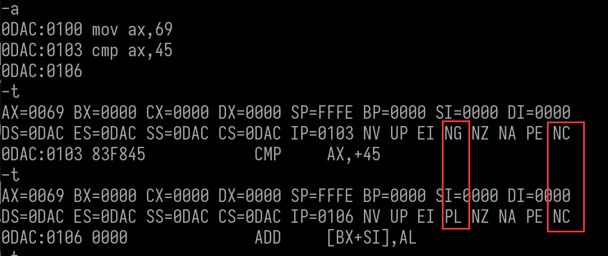

69 - 45  不产生借位,结果是正数,不为0.


跟一个与自己相等的数比较, 结果看标志位  ZF (是否为0)


69-69 结果为0,不为负数,不产生借位


 乘法 

计算机的乘法指令分为无符号乘法指令和有符号乘法指令。

它们的唯一区别就在于： 数据的最高位是作为“数值”参与运算，还是作为“符号位”参与运算。

功能：指令的功能是把显式操作数和隐含操作数相乘，并把乘积存入相应的寄存器中。

   

 无符号乘法     MUL  

格式：MUL Reg/Mem

MUL r8/m8;   AX <- AL x r8/m8 ;如果源操作数是字节，则与AL相乘，结果存入AX（如果不满，则会覆写高位为00）

MUL r16/m16; DX.AX <- AX x r16/m16; 如果源操作数是字，则与AX相乘，结果高位放入DX，低位放入AX

功能：显式操作数*隐含操作数(看成无符号数)。

影响标志位：CF和OF。

| 位数 | 隐含的被乘数 | 乘积的存放位置 | 举例    |
| ---- | ------------ | -------------- | ------- |
| 8位  | AL           | AX             | MUL BL  |
| 16位 | AX           | DX-AX          | MUL BX  |
| 32位 | EAX          | EDX-EAX        | MUL ECX |

DX 存高位   AX 存低位

影响标志位：CF 和 OF ; 	 利用CF和OF判断成绩的高位是否有效。

两种标志位情况：

**●**要么CF = OF = 1；

○8位：说明结果超过了8位

○16位：说明结果超过了16位

**●**要么CF = OF = 0

○8位：都能存下

○16位：都能存下

8位 * 8位  结果 最多为 16位

16位 * 16位  结果最多为 32 位 

 代码 

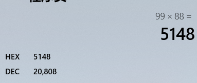


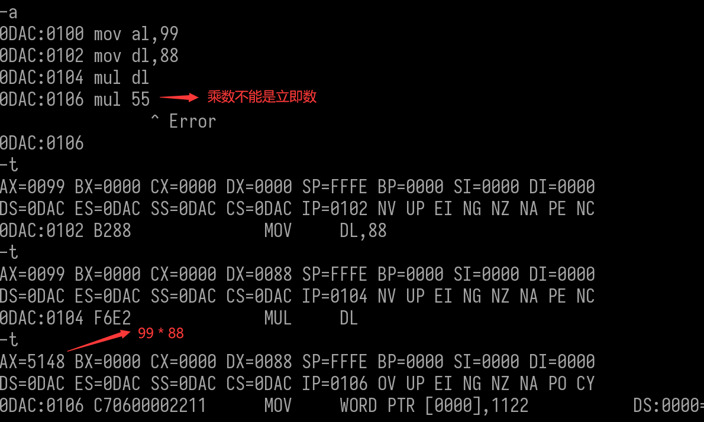

8位 * 8位 结果超过了8 位 , 所以 标志位 CF 和 标志位 OF 的值都为1  ( OV CY )


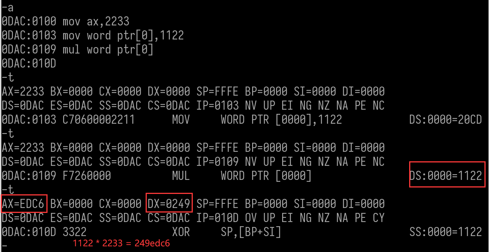

DX存结果的高位,AX存结果的低位 ,16位 * 16位 结果超过了16 位 , 所以 标志位 CF 和 标志位 OF 的值都为1 ( OV CY )


如果  8位 * 8位 结果不超过8位 , 16位 * 16 位结果不超过16位,  标志位 CF 和 标志位 OF 的值都为0 ( NV   NC )

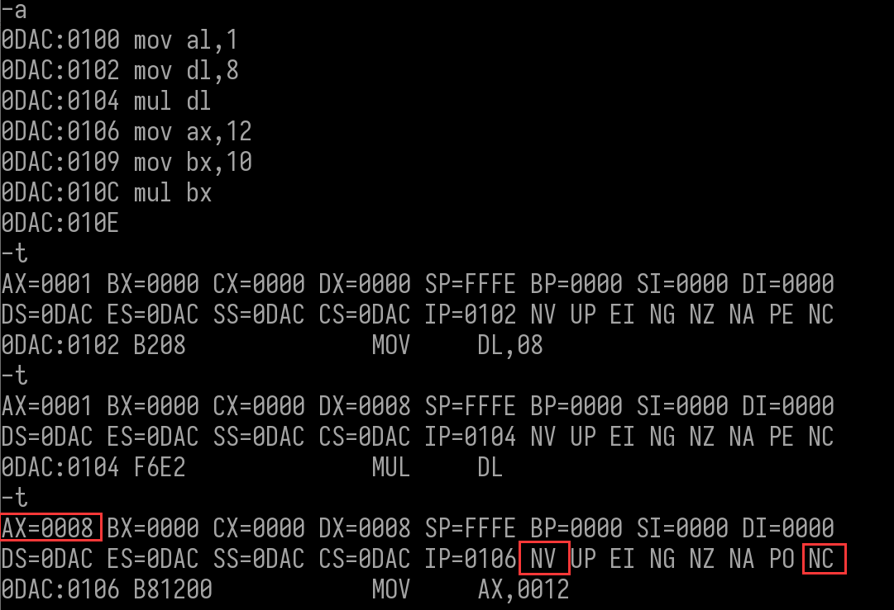


  有符号乘法   IMUL   

格式：IMUL  Reg/Mem

​           IMUL Reg, Imm ;80286+ 

​           IMUL Reg, Reg, Imm ;80286+ 

​          IMUL Reg, Reg/Mem ;80386+ 

MUL r8/m8;   AX <- AL x r8/m8 ;如果源操作数是字节，则与AL相乘，结果存入AX（如果不满，则会覆写高位为00）

UL r16/m16;DX.AX <- AX x r16/m16; 如果源操作数是字，则与AX相乘，结果高位放入DX，低位放入AX

功能：有符号数相乘。

如果相乘，最高位是符号位，则需要将高位补上符号位。

MOV al,fe

MOV bl,10

IMUL bl; 结果：AX:FFE0;相乘后，最高位需要填上补码的符号位。

影响的标志位：

两种标志位情况：

●如果乘积的高位是低位的符号扩展，则CF = OF = 0，否则CF = OF = 1


​         符号拓展 :  -4  用8位表示是  FC 16位表示 是 FFFC ,其中,16位表示的高8位 FF 其实是对低位的符号拓展,高字节全部为1,这种就称为高位是低位的符号扩展

 代码 


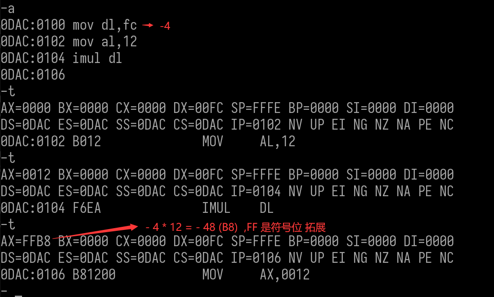


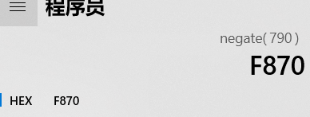


此时不是拓展,所以标志位OF,CF都是1,意思是结果超过了乘数位数


注意：

1在输入汇编操作数的时候，计算机并不知道输入的是有符号还是无符号数，是通过操作指令决定的，如上。IMUL决定操作数是有符号数。计算结果后最高位补上符号位1。


 除法 

除法也分为无符号除法和有符号除法。

除法指令的被除数是隐含操作数，除数在指令中显式地写出来。CPU会根据除数是8位、16位，还是32位，来自动选用被除数AX、DX-AX，还是EDX-EAX。

格式：DIV Reg/Mem

功能：

| 除数位数 | 隐含的被除数 | 商   | 余数 | 举例     |
| -------- | ------------ | ---- | ---- | -------- |
| 8位      | AX           | AL   | AH   | DIV  BH  |
| 16位     | DX-AX        | AX   | DX   | DIV  BX  |
| 32位     | EDX-EAX      | EAX  | EDX  | DIV  ECX |

16位  DX 存高字节 AX 存低字节

 无符号除法指令 DIV 

指令的格式：DIV  Reg/Mem指令的功能是用显式操作数去除隐含操作数(都作为无符号数)。

影响的标志位：指令对标志位的影响无定义。

未定义：指令执行后这些标志是任意的，不可预测的。

没有影响：指令执行后不改变标志状态


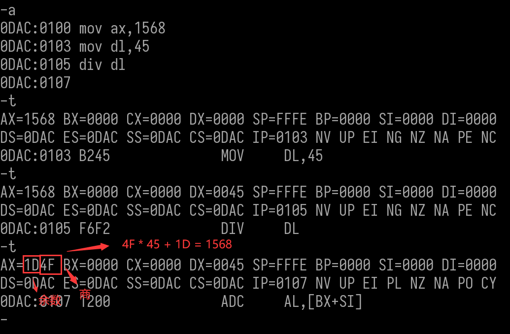


 有符号除法 IDIV 

•格式：

​    IDIV   Reg/Mem

•功能：

 影响标志位：AF、CF、OF、PF、SF和ZF。


注意：

**1**除法指令功能是用显式操作数去除隐含操作数，可得到商和余数。当除数为0，或商超出数据类型所能表示的范围时，系统会自动产生0号中断。

2效果：代码段寄存器值修改为F000，代码执行跳转到F000段里去。F000:0 

 除法溢出 

•被除数远大于除数时，所得的商就有可能超出它所能表达的范围。

•idiv除法溢出：

​     –字节除时商不在-128～127范围内，或者在字除时商不在-32768～32767范围内。

•div除法溢出：

–8位除法运算结果大于8位，16位除法运算结果大于16位。

举例：ax = FFFF，bl = FF，div bl

结果：相当于FFFF / FF = 101 ，此时AH显然放不下，所以商溢出了。


1568/1 结果 al 放不下 , 看结果好像没溢出,但是看代码地址可以看出已经不是我们的代码地址了,已经跳走了(抛异常 除0中断),已经崩了


 符号拓展指令 

 说明 

•符号扩展：用一个操作数的符号位（即最高位）形成另一个操作数。

•结果：后一个操作数各位是0(正数)或者是1(负数)。

•符号扩展不改变数据大小。

拓展的高位填充符号位 正数填充0,负数填充1

 将字节转换成字指令  CBW 

–语句格式：CBW(convert byte to word)

–功能：将AL中的符号扩展至AH中, 操作数是隐含且固定的。

8位扩展到 16 位

 将字转换成双字指令  CWD 

–语句格式：CWD

–功能：将AX中的符号扩展至DX中, 操作数是隐含且固定的

16位扩展到 32 位

 操作 

 6正数拓展    拓展的高位填充0 

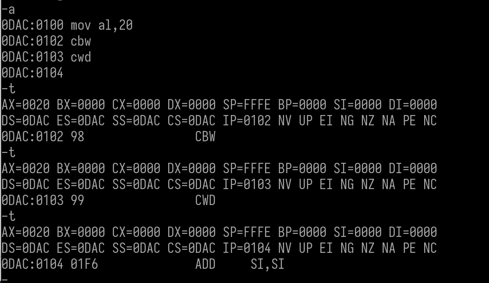


 6负数拓展     拓展的高位填充1 


用法:   word  跟  字节 要做乘法 ,要先把 字节拓展成 word

  位操作类指令 

 逻辑运算 

逻辑运算指令是另一组重要的指令，它包括：逻辑与([AND](https://www.yuque.com/dumuchenglin-lkzo5/iv45q8/ky82gp#AND))、逻辑或([OR](https://www.yuque.com/dumuchenglin-lkzo5/iv45q8/ky82gp#OR))、逻辑非([NOT](https://www.yuque.com/dumuchenglin-lkzo5/iv45q8/ky82gp#NOT))和异或指令([XOR](https://www.yuque.com/dumuchenglin-lkzo5/iv45q8/ky82gp#XOR))，逻辑运算指令也是经常使用的指令。

| 指令 | 格式         | 意义             | 影响标志位          |
| ---- | ------------ | ---------------- | ------------------- |
| AND  | AND DST,SRC  | 按位与 &         | SF, ZF, PF, OF=CF=0 |
| OR   | OR   DST,SRC | 按位或 \|        | SF, ZF, PF, OF=CF=0 |
| XOR  | XOR DST,SRC  | 按位异或^        | SF, ZF, PF, OF=CF=0 |
| NOT  | NOT SRC      | 按位取反~        | 不影响              |
| TEST | TEST DST,SRC | 按位与，不存结果 | SF, ZF, PF, OF=CF=0 |

逻辑运算的应用场景：

**1**如果要将目的操作数中某些位清0，用AND，称之为屏蔽。

**2**将目的操作数中某些位置1，用OR

**3**测试目的操作数中某一位或则某几位是否为0或1，而目的操作数不变，用TEST。

**4**TEST 与CMP 的区别，前者是测试以为或几位，后者测试整个字节/字/双字，是否相等。所以时钟周期CMP的好TEST。

**5**操作数自身作或、与运算，结果不变，还是自身。

**6**XOR AX，AX将AX置0，比MOV AX，0更高效。位运算快。


 逻辑与  AND(Logical AND Instruction) 

​    同1为1,其他为0

●指令的格式：AND Reg/Mem, Reg/Mem/Imm

●受影响的标志位：CF(0)、OF(0)、PF、SF和ZF(AF无定义)

●指令的功能：把源操作数中的每位二进制与目的操作数中的相应二进制进行逻辑“与操作”，操作结果存入目标操作数中。

●应用场景：去除某风格。将风格与掩码做与运算。掩码为该风格位的取反。

●示例：已知(BH)=67H，要求把其的第0、1和5位置为0。

○可以构造一个立即数，其第0、1和5位的值为0，其它位的值为1，该立即数即为：0DCH或11011100B，然后用指令"AND BH, 0DCH"来实现此功能

○

01100111

AND

11011100

01010100

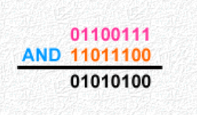


●TEST 可以判断风格。

 逻辑或  OR(Logical OR Instruction) 

​     同0为0,其他为1

●指令的格式：OR Reg/Mem, Reg/Mem/Imm

●受影响的标志位：CF(0)、OF(0)、PF、SF和ZF(AF无定义)

●指令的功能：把源操作数中的每位二进制与目的操作数中的相应二进制进行逻辑"或操作"，操作结果存入目标操作数中。

 逻辑非  not 

   1为0,0为1

●指令的格式：NOT   Reg/Mem

● 受影响的标志位：无

 逻辑异或：XOR 

​     相同为1,不同为0

●指令的格式：XORReg/Mem, Reg/Mem/Imm

●受影响的标志位：CF(0)、OF(0)、PF、SF和ZF (AF无定义)

 按位与  TEST指令  

●格式：TEST Reg/Mem，Reg/Mem/Imm

●作用：执行AND，但是不影响目的操作数。就影响标志位，和CMP类似。

●影响的标志位：CF(0)、OF(0)、PF、SF和ZF（AF无定义）

●例子：  判断 AX 是不是0      TEST  AX，AX  


```
abab 1010 1011 1010 1011 
cccc 1100 1100 1100 1100
   & 1000 1000 1000 1000  8888
1111 0001 0001 0001 0001
   | 1001 1001 1001 1001  9999
20cd 0010 0000 1100 1101
   ^ 1011 1001 0101 0100  b954
   ~ 0100 0110 1010 1011  46ab
2323 0010 0011 0010 0011
   | 0110 0111 1010 1011  67ab
```

#### 移位

​    位运算技巧 : https://blog.csdn.net/haskei/article/details/53010674

​                           https://blog.csdn.net/qq_37772475/article/details/104500916

-   移位操作指令是一组经常使用的指令，它包括算术移位、逻辑移位、双精度移位、循环移位和带进位的循环移位等五大类。
-   移位指令都有指定移动二进制位数的操作数，**该操作数可以是立即数或****CL的值****。**在8086中，**该立即数只能为1，但在其后的CPU中，该立即数可以是1··31之内的数**

###### 移位指令概览

**1. SHL  r/m ,imm/cl            2. SHR  r/m ,imm/cl**

**3. SAL  r/m ,imm/cl            4. SAR  r/m ,imm/cl**

**5. SHL  r/m ,imm/cl            6. SHR  r/m ,imm/cl**

**7. SAL  r/m ,imm/cl             8. SAR  r/m ,imm/cl**

| X代表 | 含义                       |
| ----- | -------------------------- |
| H     | 逻辑移位(logical)          |
| A     | 算术移位(arithmetic)       |
| O     | 循环移位(Rotate)           |
| C     | 带进位的循环移位     carry |

##### 算术移位  和 逻辑移位

都分 左移 L 和 右移 R

算术左移和逻辑左移的功能一模一样

算术右移 和 逻辑右移的区别是  算术右移高位补符号位(正数补0,负数补1) ,逻辑右移高位是补 0 


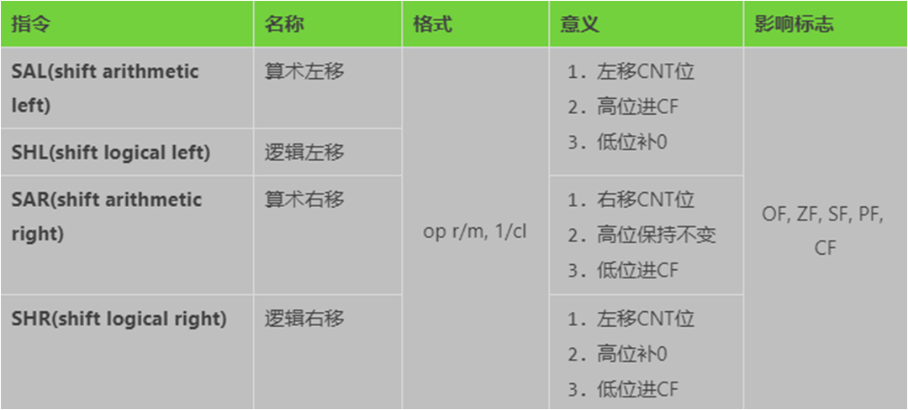

###### 算术左移SAL   算术右移SAR

**它们的指令格式如下：**

**格式：**`**SAL/SAR Reg/Mem, CL/Imm**` 

**作用：**

-   SAL把目的操作数的低位向高位移，空出的低位补0； 

-   SAR把目的操作数的高位向低位移，空出的高位用最高位(符号位)填补

**受影响的标志位：CF、OF、PF、SF和ZF(AF无定义)。**

SAL：把目的操作数的低位向高位移，空出的低位补0,移出来的最后一位 进 CF；

SAR：把目的操作数的高位向低位移，空出的高位用最高位(符号位)填补,移出来的最后一位 进 CF。可用于有符号位除法(除 2 的 n次幂)


###### 逻辑左移 SHL    逻辑右移 SHR

**原理：**逻辑左移/右移指令只有它们的移位方向不同，移位后空出的位都补**0**。

**受影响的标志位**：CF、OF、PF、SF和ZF(AF无定义)

**指令格式**：`SHL/SHR Reg/Mem, 1/CL`

SHL：把目的操作数的低位向高位移，空出的低位补0,移出来的最后一位 进 CF；

SHR：把目的操作数的高位向低位移，空出的高位用最高位(符号位)填补,移出来的最后一位 进 CF。


###### 操作

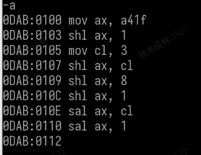


##### 循环移位  和   带进位循环移位

循环左移/右移指令只是移位方向不同，它们移出的位不仅要进入CF，而且还要填补空出的位


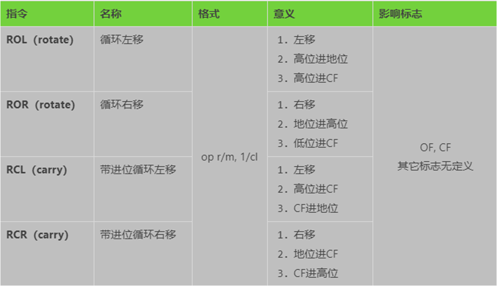


###### 循环左移 ROL    循环右移 ROR

**指令格式：**`ROL/ROR Reg/Mem, 1/CLs`

 **作用：**

​       循环左移/右移指令只是移位方向不同，它们移出的位不仅要进入CF，而且还要填补空出的位

**受影响的标志位：**CF和OF

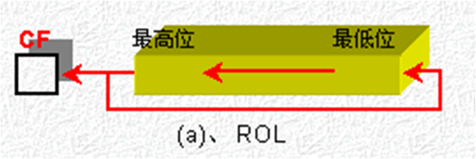

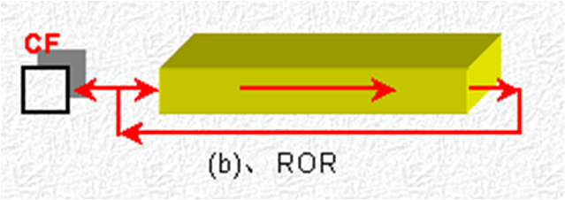


###### 带进位循环左移 RCL   带进位循环右移 RCR

   带进位的循环左移／右移指令只有移位的方向不同，它们都用原CF的值填补空出的位，移出的位再进入CF。

 **指令格式：**`RCL/RCR Reg/Mem, 1/CLs`

**作用：**

  带进位的循环左移／右移指令只有移位的方向不同，它们都用原CF的值填补空出的位，移出的位再进入CF。

**受影响的标志位：**CF和OF


### 作业

**无分支求绝对值**

```
int y ;
y = x >> 31 ;
return (x^y)-y ;    //or: (x+y)^y
```


```
mov ax,-7
mov cx,ax
sar cx,15
xor ax,cx
sub ax,cx
    
 或者 
    
mov ax,-7
mov cx,ax
sar cx,15
add ax,cx
xor ax,cx  

或者

mov ax, -7
cwd
xor ax, dx
sub ax, dx
```

**无分之求三目运算**

1.reg == 8 ? 13:7

```
mov ax,8
sub ax,8
neg ax
sbb ax,ax		
and ax,6		//这里是差值
mov bx,D	    //这里是较大的数
sub bx,ax

mov ax,ff
sub ax,8
neg ax
sbb ax,ax		
and ax,6		
mov bx,D	
sub bx,ax
```

```
mov ax,4
sub ax,4
neg ax
sbb ax,ax
and ax,5      //这里5是差值
add ax,6      //这里是较小的数


mov ax,FF
sub ax,4
neg ax
sbb ax,ax		
and ax,5		
add ax,6
```


