## 串操作

### 串操作

源操作数使用si，默认段为DS，可段超越

目的操作数使用di，默认段为ES，不可段超越

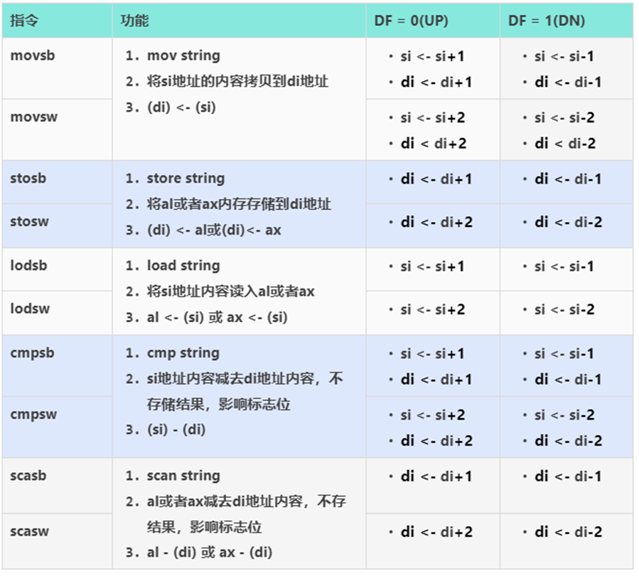

### 串方向

串方向由DF标志位影响，可以由指令修改


### 重复前缀

串操作指令一般都配合重复前缀使用，实现内存的批量操作。

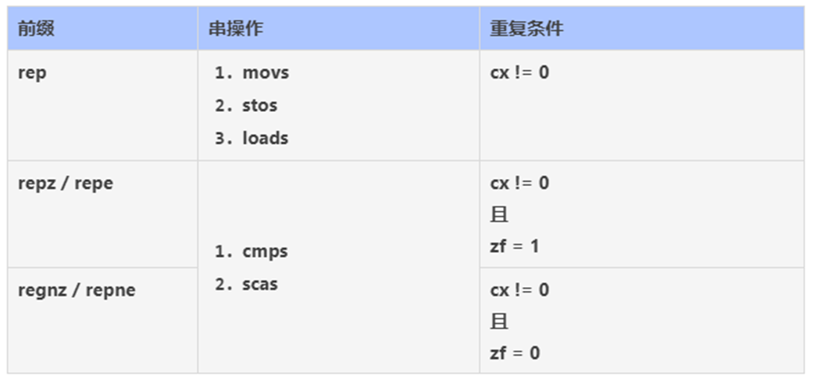

## 流程转移指令

### 1.无条件跳转

####  直接转移  jmp


##### 短跳     jmp  或者  jmp short

偏移值范围是  - 128(80H)  到  127(7FH)  , 偏移值大小是 一个字节

```
;栈段
stack segment stack

stack ends 

;数据段
data segment 
  g_szBuf db 255 dup(0)
data ends 

;代码段
code segment

START: 
    assume ds:data   ;指定data段 作为 ds 段
    mov ax,data      ;先把data的偏移值给ax
    mov ds,ax        ;ax再把data的偏移值给ds
                     ;不直接给是因为没有立即数到段寄存器
    mov ax,ax
    mov ax,ax
    jmp   LEABEL1  ; 跳转到标号 LEABEL1
    mov ax,ax
    mov ax,ax
 

 LEABEL1:  
    mov dx,dx
    mov dx,dx
    jmp   LEABEL2  ; 跳转到标号 LEABEL2
    mov dx,dx
   
LEABEL2:    
    mov cx,cx
    mov cx,cx
   
code ends 
end START 
```


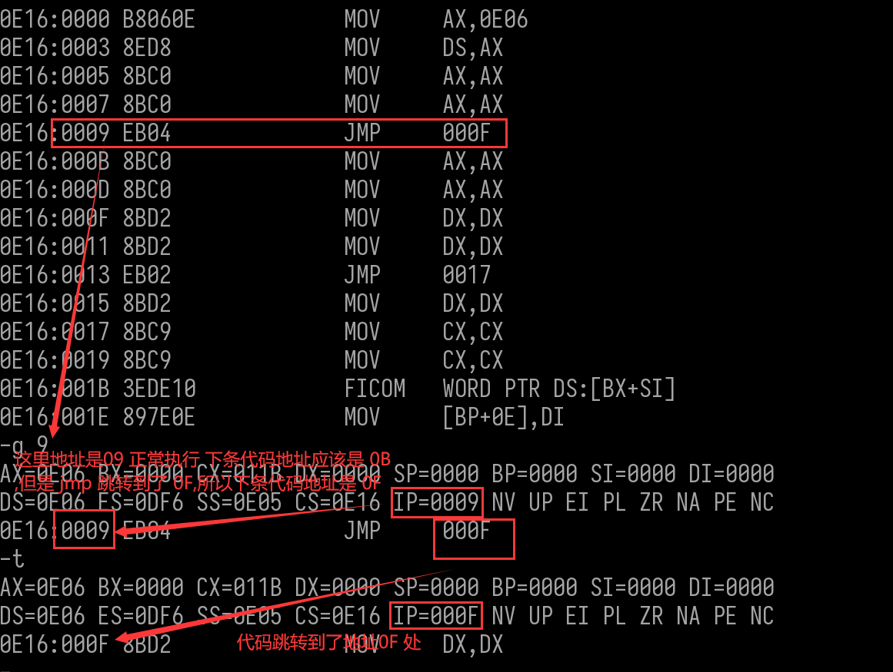


ip 里面存的是下一条指令的地址. ip被改了,代表下一条指令 也被修改了

#### 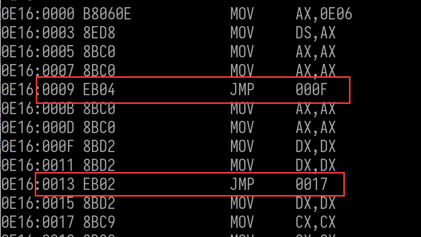

jum 既然能跳转,那么指令肯定包含了 要跳转的地址信息 ,那么是如果做到的呢    

| 开始IP | 跳转IP | 地址偏移值 | 机器码 |
| ------ | ------ | ---------- | ------ |
| 0009   | 000f   | 6          | EB04   |
| 0013   | 0017   | 4          | EB02   |

从表格中我们不难分析出来  EB 代表 jmp 指令 ,其机器码中并没有直接存储 目标地址的 ip信息 ,也不是直接存储偏移,而是地址偏移值 - 2  , 即 下一条指令 到 目标地址的偏移,那为什么不存储本条指令地址和目的地址的偏移,而要存下一条的呢,因为当一条指令执行完,IP地址就指向了下一条指令的ip地址,如果要储存自己和目标指令的偏移,需要先 -  2 ,把ip地址 改回当前自己的,再去算偏移,所以就直接存储 下条指令的 ip 地址 和目标地址的偏移


上面是考虑的是 从上往下跳,如果从下往上跳呢

```
stack segment stack    ;栈段

stack ends 

data segment     ;数据段
  g_szBuf db 255 dup(0)
data ends 

code segment    ;代码段

START: 

    assume ds:data   ;指定data段 作为 ds 段
    mov ax,data      ;先把data的偏移值给ax
    mov ds,ax        ;ax再把data的偏移值给ds
                     ;不直接给是因为没有立即数到段寄存器
    mov ax,ax
    mov ax,ax

    jmp   LEABEL1  ; 跳转到标号 LEABEL1

    mov ax,ax
    mov ax,ax
 

 LEABEL1:   

    mov dx,dx
    mov dx,dx
    jmp   LEABEL1  ; 跳转到标号 LEABEL1
    jmp   LEABEL2  ; 跳转到标号 LEABEL2
    mov dx,dx
   
LEABEL2:    
    mov cx,cx
    mov cx,cx

code ends 
end START 
```

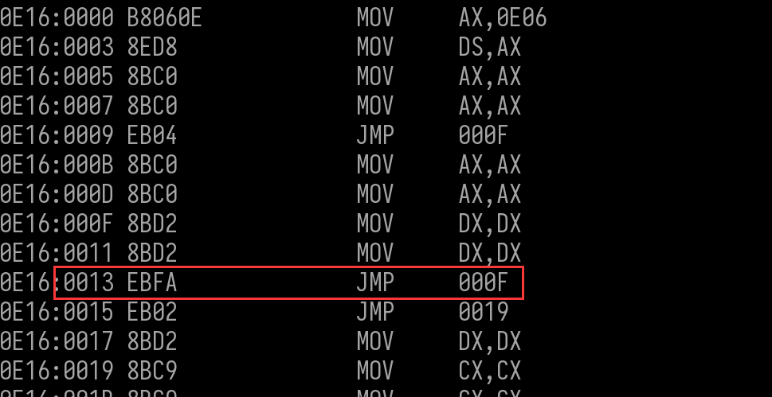

| 开始IP | 跳转IP | 地址偏移值 | 机器码 |
| ------ | ------ | ---------- | ------ |
| 0013   | 000f   | -4         | EBFA   |

FA 是   -6   , -4  =  -6 +2  ,因此向上跳  也是 记录的 下条指令 到 目标地址的 偏移   

##### 近跳    jmp  或者  jmp  near

短跳的偏移值 范围 是 - 128(80H)  到  127(7FH)  ,如果超过这个范围,那么短跳将无法实现,此时就需要用到近跳 

近跳  偏移值范围是  - 32766((8000H))  到 32765(7FFFH)  , 偏移值大小是 一个字

```
stack segment stack    ;栈段
stack ends 

data segment   ;数据段
  g_szBuf db 255 dup(0)
data ends 

code segment  ;代码段

START: 

    assume ds:data   ;指定data段 作为 ds 段
    mov ax,data      ;先把data的偏移值给ax
    mov ds,ax        ;ax再把data的偏移值给ds
                     ;不直接给是因为没有立即数到段寄存器
    mov ax,ax
    mov ax,ax

    jmp   LEABEL1  ; 跳转到标号 LEABEL1,此时跳转范围超过一个字节

    mov ax,ax
    mov ax,ax
    db 255 dup(0)  
 
 LEABEL1:   

    mov dx,dx
    mov dx,dx
    jmp   LEABEL1  ; 跳转到标号 LEABEL1
    jmp   LEABEL2  ; 跳转到标号 LEABEL2
    mov dx,dx
   
LEABEL2:    
    mov cx,cx
    mov cx,cx
   
code ends 
end START 
```


此时  这条指令 占3个字节,偏移值是一个 word  ,偏移值 是  0103 (小尾保存的 ) 

 000c  (下条指令地址) + 0103 (偏移值)  =   010F  及目标地址

##### 远跳   jmp far

上面都是在一个段内跳转,如果在不同段内跳转 ,其偏移值 可以 超过 word 的表达范围,此时就需要用远跳

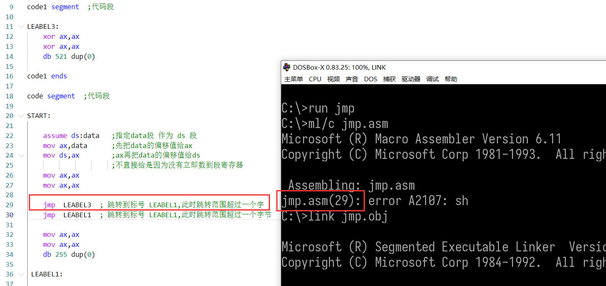

```
stack segment stack    ;栈段
stack ends 

data segment   ;数据段
  g_szBuf db 255 dup(0)
data ends 

code1 segment  ;代码段
  db 64 dup(0)
LEABEL3: 
    xor ax,ax
    xor ax,ax
    db 521 dup(0)

code1 ends

code segment  ;代码段

START: 

    assume ds:data   ;指定data段 作为 ds 段
    mov ax,data      ;先把data的偏移值给ax
    mov ds,ax        ;ax再把data的偏移值给ds
                     ;不直接给是因为没有立即数到段寄存器
    mov ax,ax
    mov ax,ax

    ;jmp far ptr LEABEL3  ; 跳转到标号 LEABEL3,此时是跨段跳
    jmp code1:LEABEL3    ; jmp 段名:标号名  ,效果跟上面一样  

    jmp  LEABEL1  ; 跳转到标号 LEABEL1,此时跳转范围超过一个字节

    mov ax,ax
    mov ax,ax
    db 255 dup(0)  
 
 LEABEL1:   

    mov dx,dx
    mov dx,dx
    jmp   LEABEL1  ; 跳转到标号 LEABEL1
    jmp   LEABEL2  ; 跳转到标号 LEABEL2
    mov dx,dx
   
LEABEL2:    
    mov cx,cx
    mov cx,cx
   
code ends 
end START 
```

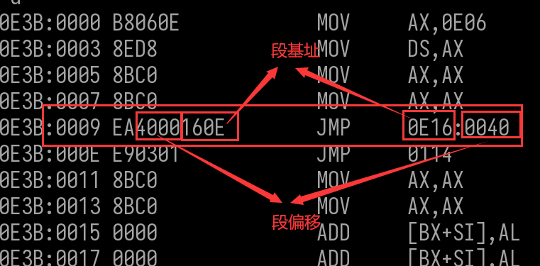

##### 指令偏移计算

 指令中的偏移值是下一条指令到目的地址的偏移。


##### 指令偏移计算练习

计算下列指令的机器码，短跳 0xEB，近跳 0xE9，远跳跳 0xEA。

0AE7:0102 jmp 0120 --  EB1C     

-   120 -  104  =   1C   所以机器码是  E91B02

​    

0AE7:0102 jmp 0320 --   E91B02

​    

-   因为偏移值超过一个字 ,偏移值是字,因此这条指令是 3个字节 ,下条指令地址是 105

320 -  105  =  021B   所以机器码是  E91B02

​    

0AE7:0102 jmp 20 --   E91BFF

-   104 - 20 = E4  取反是 FF1C 用一个字节无法表示,所以偏移值应该是用一个字表示,那么该条指令应该是3个字节,下条指令地址应该是 105,  105 - 20 = E5  取反 FF1B   所以机器码是 E91BFF

​    

0AE7:0402 jmp 0100 --   E9FBFD

-   该条指令偏移值明显看出是一个字,所以指令长度3 ,下条指令地址是 405, 405 - 100 = 305 取反 FDFB,所以机器码是  E9FBFD

​    

0AE7:0122 jmp 0110 --   EBEC

-   124 - 110 = 14 取反是  EC    所以机器码是  EBEC 


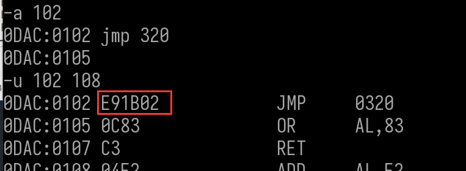


##### 使用寄存器间接转移

-   格式 jmp reg
-   reg 为通用寄存器,不涉及段寄存器
-   功能 ip <- reg
-   只能用于段内转移

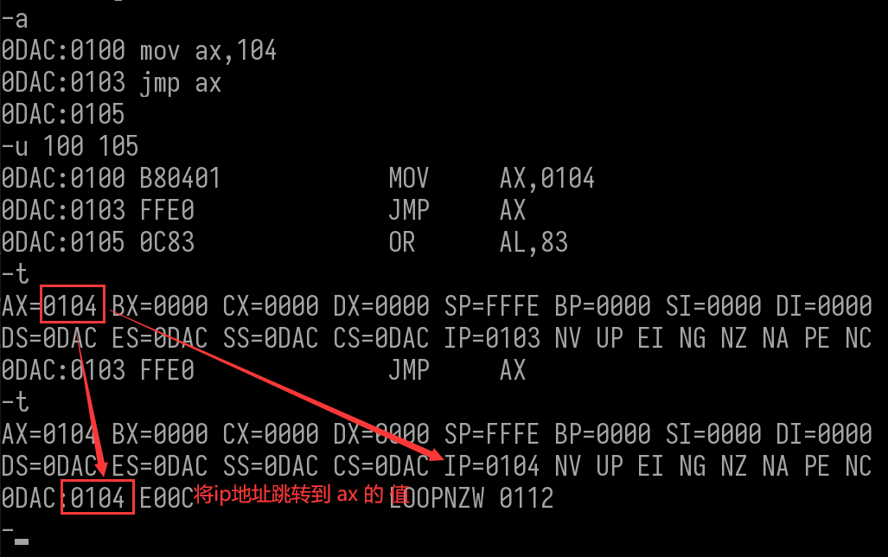

##### 使用EA的间接转移

把跳转地址存到内存, 跳转时 从 内存里取 出跳转的目标地址

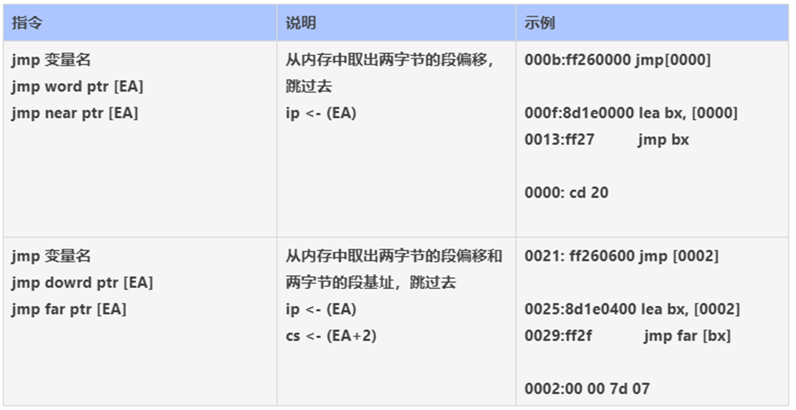

**注意：**

​        **在运用转移的时候需要遵循C语言的流程标准，因为类似于goto，不能从一个函数跳到另外一个函数，影响堆栈平衡。**

```
stack segment stack    ;栈段
stack ends 

data segment   ;数据段
  g_w dw 0
data ends 

code segment  ;代码段

START: 

    assume ds:data   ;指定data段 作为 ds 段
    mov ax,data      ;先把data的偏移值给ax
    mov ds,ax        ;ax再把data的偏移值给ds
                     ;不直接给是因为没有立即数到段寄存器
  
    mov g_w, offset  LEABEL4 ;将 LEABEL4 的  偏移值给 g_w
    jmp g_w  
     
    mov ax,ax
    xor ax,ax

 LEABEL4:   
    
    ;带返回码的退出
    mov ax,4C00H
    int 21 
     
code ends 
end START 
```

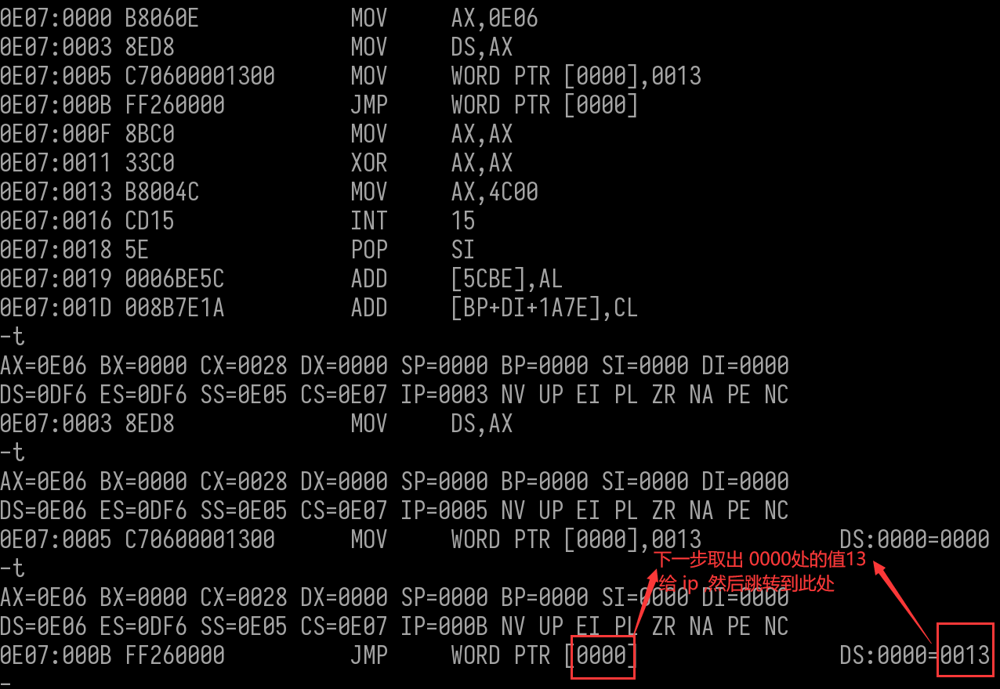


```
stack segment stack    ;栈段
stack ends 

data segment   ;数据段
  g_w dw 0
  g_wEA dw 0
  g_wCS dw 0 
data ends 


code1 segment  ;代码段
  db 64 dup(0)
LEABEL3: 
    xor ax,ax
    xor ax,ax
    db 521 dup(0)

code1 ends

code segment  ;代码段

START: 

    assume ds:data   ;指定data段 作为 ds 段
    mov ax,data      ;先把data的偏移值给ax
    mov ds,ax        ;ax再把data的偏移值给ds
                     ;不直接给是因为没有立即数到段寄存器
  
    mov g_wEA,offset LEABEL3 ;将 LEABEL3 的  偏移值给 g_wEA
    ;mov g_wCS,code          ;将 LEABEL3 的 段基址给 g_wCS
    mov  g_wCS,seg LEABEL3   ;将 LEABEL3 的  段基址给 g_wCS
  
    lea bx,g_wEA             ;将 g_wEA 的  偏移地址给 bx
    jmp dword ptr [bx]       ;取出偏移值为bx (即 g_wEA) 处的值,并跳转到该处 

   
    jmp g_w  
     
    mov ax,ax
    xor ax,ax

 LEABEL4:   
    
    ;带返回码的退出
    mov ax,4C00H
    int 21 
     
code ends 
end START 
```

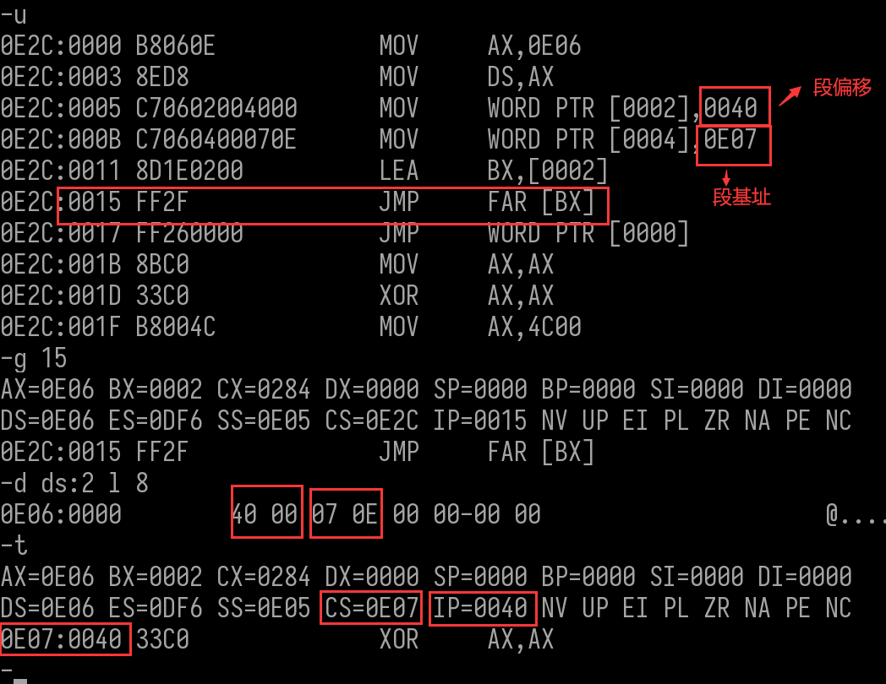

#### 2.条件跳转

依据标志位判断，条件成立则跳转，条件不成立则不跳。

##### 单条件跳转

深色表示常用,需要掌握 ,其他的表是用的比较少,熟悉即可

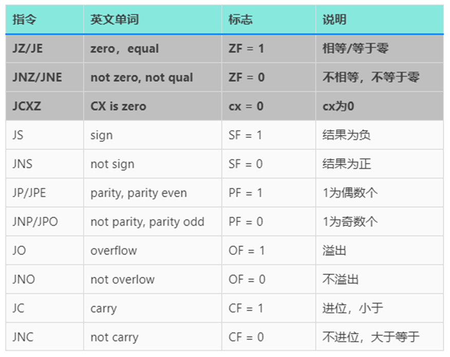

###### jz/je

比较2个数,相等输出  eaqul  不等输出  not eaqul

```
stack segment stack    ;栈段
stack ends 

data segment   ;数据段
  g_w0 dw 1122H
  g_w1 dw 3344H
  g_w2 dw 1122H
  g_szEqu db "eaqul",0dh,0ah,'$'
  g_szNEqu db "not eaqul",0dh,0ah,'$'
data ends 

 

code segment  ;代码段

START: 

    assume ds:data   ;指定data段 作为 ds 段
    mov ax,data      ;先把data的偏移值给ax
    mov ds,ax        ;ax再把data的偏移值给ds
                     ;不直接给是因为没有立即数到段寄存器
  
   
    mov ax,g_w0   ;将 g_w0 的值 给 ax
    cmp ax,g_w1   ; ax的值 和 g_w1 作比较
    
    jz  LEABEL2   ; 如果比较的值相等则跳转 LEABEL2 标号处

    ;输出字符串  g_szNEqu
    lea dx,g_szNEqu
    mov ah,09H
    int 21H

    mov ax,g_w0   ;将 g_w0 的值 给 ax
    cmp ax,g_w2   ; ax的值 和 g_w2 作比较
    
    jz  LEABEL2   ; 如果比较的值相等则跳转 LEABEL2 标号处

    ;输出字符串  g_szNEqu
    lea dx,g_szNEqu
    mov ah,09H
    int 21H

    jmp EXIT

LEABEL2:
    ;输出字符串  g_szEqu
    lea dx,g_szEqu
    mov ah,09H
    int 21H

 EXIT:    

    ;带返回码的退出
    mov ax,4C00H
    int 21H 
     
code ends 
end START 
```

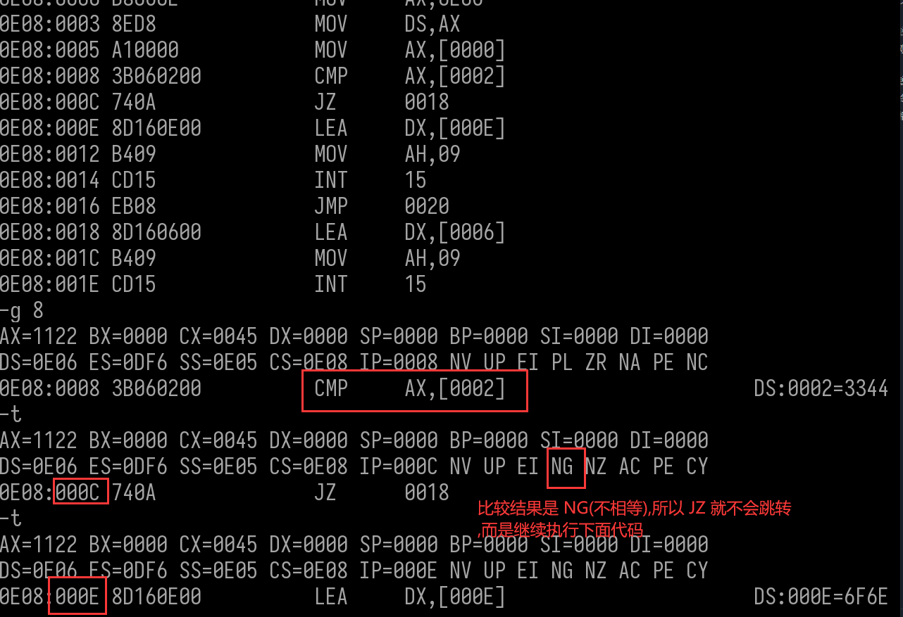

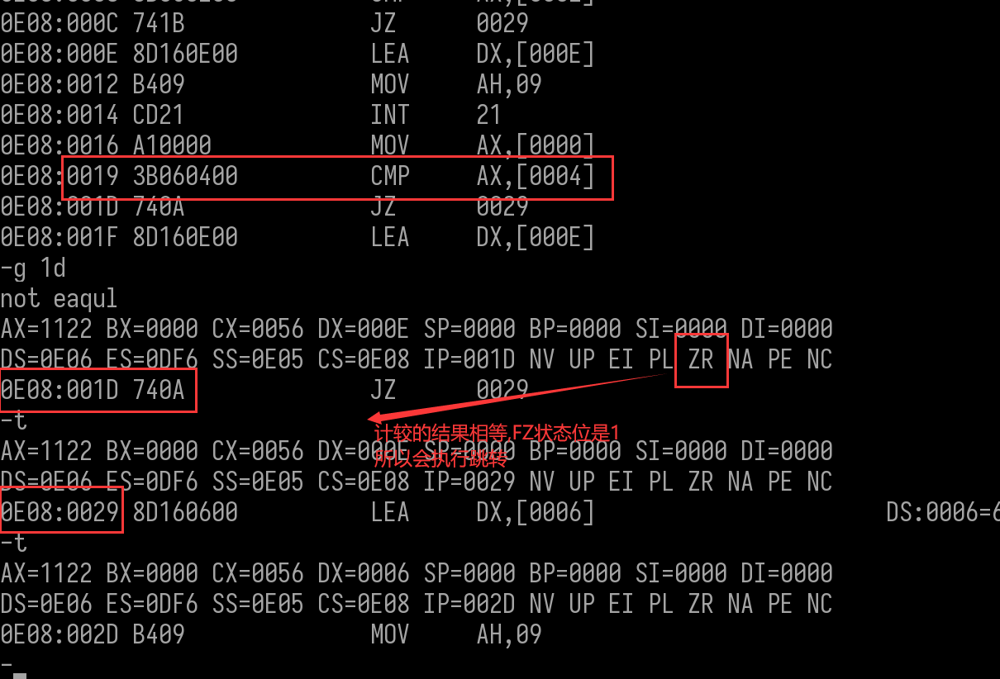


###### jcxz

判断2个字符串是否相等,相等则输出   eaqul  否则输出   eaqul not

```
stack segment stack    ;栈段
stack ends 

data segment   ;数据段
  g_w0 dw 1122H
  g_w1 dw 3344H
  g_w2 dw 1122H
  g_szEqu db "eaqul",0dh,0ah,'$'
  g_szNEqu db "eaqul not ",0dh,0ah,'$'
data ends 

 

code segment  ;代码段

START: 

    assume ds:data   ;指定data段 作为 ds 段
    cld
    mov ax,data      ;先把data的偏移值给ax
    mov ds,ax        ;ax再把data的偏移值给ds
    mov es,ax        ;不直接给是因为没有立即数到段寄存器
    
   
   mov cx,offset g_szNEqu - offset g_szEqu
   lea si,g_szEqu
   lea di,g_szNEqu
   repz cmpsb       ;2个字符串进行比较,直到cx等于0,或者不等退出
   
   jcxz LEABEL2    ;如果 cx 等于 0 则跳转,否则不跳转

    ;输出字符串  g_szNEqu
    lea dx,g_szNEqu
    mov ah,09H
    int 21H

    jmp EXIT

LEABEL2:
    ;输出字符串  g_szEqu
    lea dx,g_szEqu
    mov ah,09H
    int 21H

 EXIT:    

    ;带返回码的退出
    mov ax,4C00H
    int 21H 
     
code ends 
end START 
```

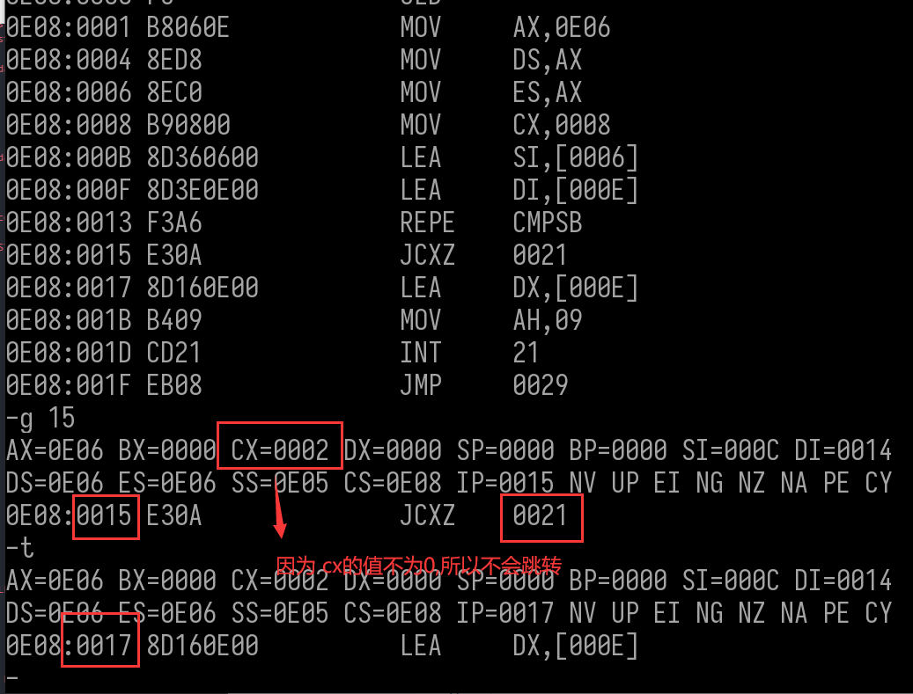


C:\>DEBUG JMP.EXE

-G

EAQUI

NOT

NORMALLY (0000)

PROGRAM TERMINATED

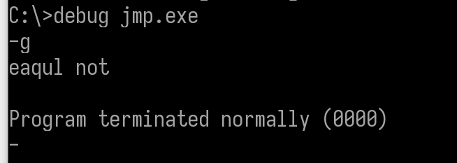


 无符号数判断 


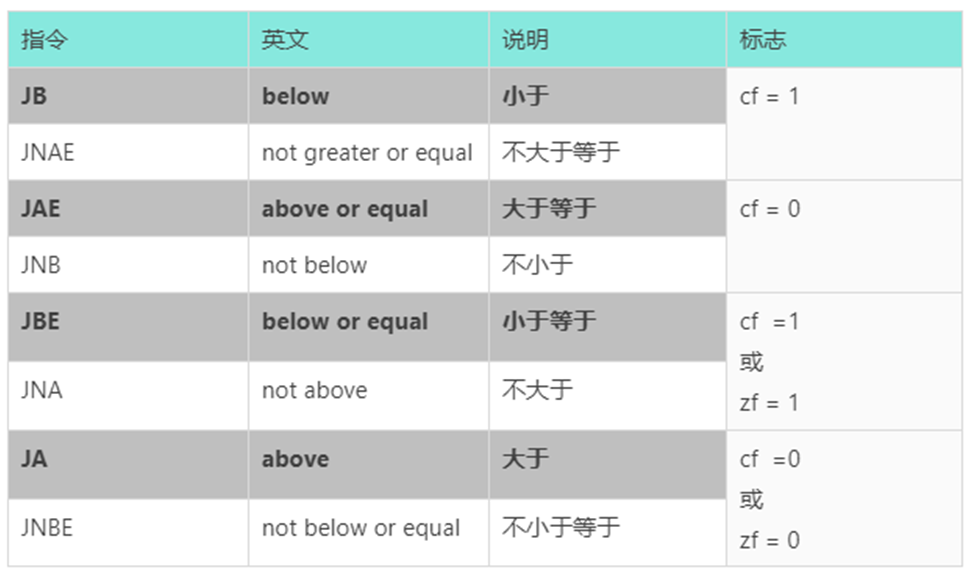


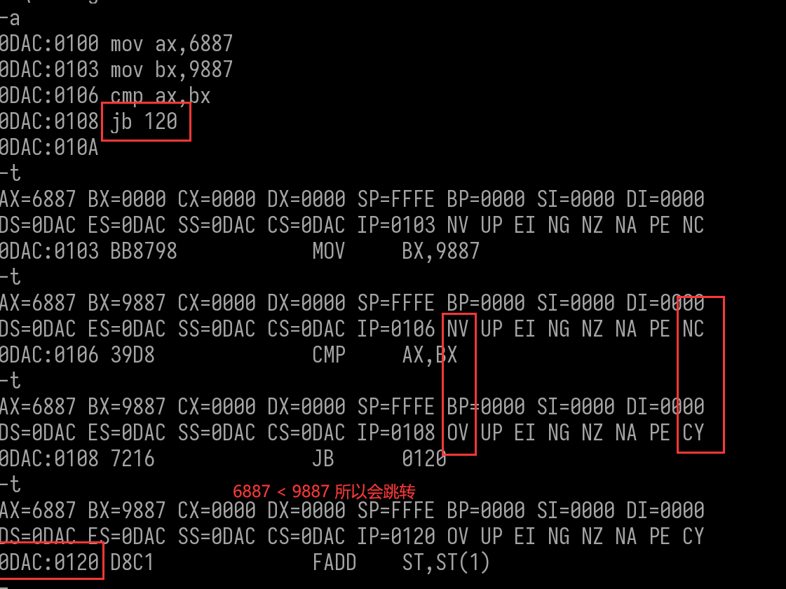


 有符号数判断 


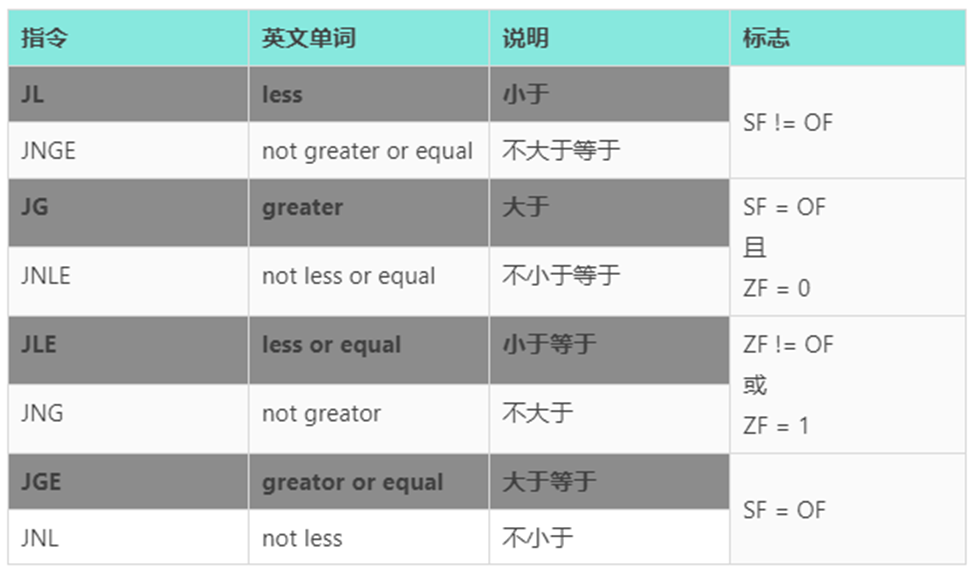


 3.LOOP 

使用频率很高    只能用于短转移

格式： loop 标号

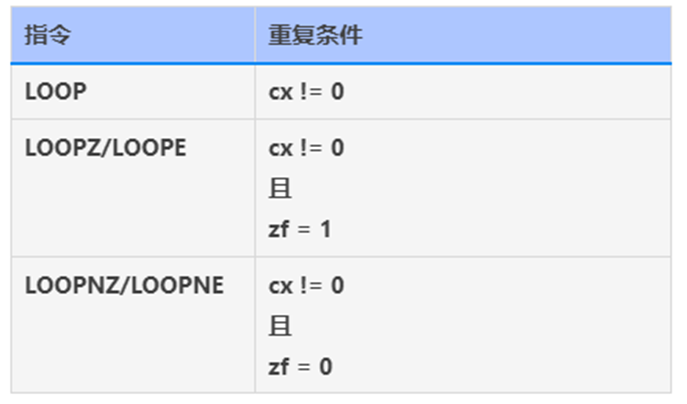


字符串小写转大写,并输出

```
stack segment stack    ;栈段
stack ends 

data segment   ;数据段
  g_w0 dw 1122H
  g_w1 dw 3344H
  g_w2 dw 1122H
  g_sz db "helloworld",0,0dh,0ah,'$'
  g_szEqu db "eaqul",0dh,0ah,'$'
  g_szNEqu db "eaqul not ",0dh,0ah,'$'
data ends 

 

code segment  ;代码段

START: 

    assume ds:data   ;指定data段 作为 ds 段
    cld
    mov ax,data      ;先把data的偏移值给ax
    mov ds,ax        ;ax再把data的偏移值给ds
    mov es,ax        ;不直接给是因为没有立即数到段寄存器
    
   
    ;输出字符串  g_szNEqu
    lea dx,g_sz
    mov ah,09H
    int 21H

    mov cx,offset g_szEqu - offset g_sz -4 ;去掉\0 和\r\n,'$'
    lea bx,g_sz


LEABELLOOP:
    ;小写转大写
    mov si,cx
    sub byte ptr[bx+si-1], 20h
    loop LEABELLOOP  

    ;输出字符串  g_szNEqu
    lea dx,g_sz
    mov ah,09H
    int 21H

 EXIT:    

    ;带返回码的退出
    mov ax,4C00H
    int 21H 
     
code ends 
```

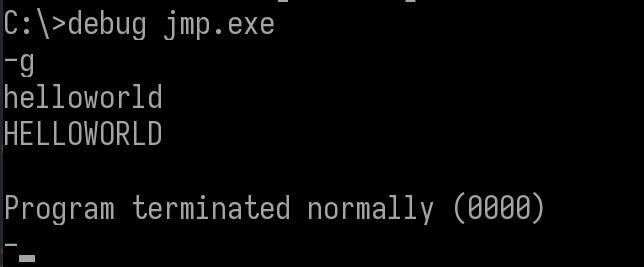

## 作业

#### 1. 输入5行文本，统计每行文本的单词的个数，并输出。

```
;输入5行文本，统计每行文本的单词的个数，并输出。
;这里是数据
data segment    ;变量不允许重名 
  g_w dw   0     ;记录循环次数
  g_sz1 db 6 dup('$')     ;用于输出长度的字符串
  g_sz db 255 dup('$')   ;用于输入的字符串
  g_Number db "0","1","2","3","4","5","6","7","8","9","A","B","C","D","E","F" ; 数字数组
data ends

;这里是代码
code  segment   ;段开始
 
LEABEL1:  ;初始化字符串
  ;将字符串重置
   mov al,'$'
   lea di,g_sz     
   mov cx,length g_sz 
   REP stosb

   lea di,g_sz1     
   mov cx,length g_sz1 
   REP stosb
  jmp  LEABEL2

START:  ;标号
    assume ds:data   ;指定data段 作为 ds 段
    mov ax,data      ;先把data的偏移值给ax
    mov ds,ax        ;ax再把data的偏移值给ds
    mov es,ax        ;不直接给是因为没有立即数到段寄存器
                            

    mov cx,5  ;循环次数
LEABELLOOP:

  mov g_w,cx
   jmp  LEABEL1

LEABEL2:   
   lea bx,g_sz           ;获取字符串 g_sz 的首地址
   mov word ptr [bx],size  g_sz  ;把字符串大小给  byte ptr [bx]
   mov dx,bx                     ;把地址给 dx 
  ;输入字符串
   mov ah,0aH   ; 将功能编号给ah
   int 21H     ;调用21号中断

   mov ax,0
   mov al,byte ptr[g_sz+1] 
   mov si,ax
   mov word ptr [g_sz+2+si],0d0aH   ;添加字符串后加'\r\n'

   lea dx,g_sz           ;获取字符串 g_sz 的首地址
   add dx,2
   ;输出字符传串
   mov ah,9   ; 将功能编号给ah
   int 21H     ;调用21号中断

    ;将长度给g_sz1
    ;把DX清0 
    mov dx,0
    mov dl,byte ptr[g_sz+1] 
    ;然后取出低四位去数组里找到对应的存储
    mov cl,4
    shr dx,cl;右移四位得到低四位

    mov si,dx
    mov cl,g_Number[si] ;把数组第bx个元素给cx寄存器
    ;然后把cl里的值给输出数字的字符串
    mov byte ptr [g_sz1] ,cl

    ;开始取第二位
    mov dx,0;
    mov dl,byte ptr[bx+1] 
    mov cl,12
    shl dx,cl
    shr dx,cl
    mov si,dx
    mov cl,g_Number[si] ;把数组第bx个元素给cx寄存器

    ;然后把cl里的值给输出数字的字符串
    mov byte ptr [g_sz1+1] ,cl
    mov word ptr [g_sz1+2],0d0aH   ;添加字符串后加'\r\n'

    lea dx,g_sz1           ;获取字符串 g_sz 的首地址
    ;输出字符传串
    mov ah,9   ; 将功能编号给ah
    int 21H     ;调用21号中断
    mov cx,g_w
    loop LEABELLOOP  

 EXIT:  
    mov ax,4C00H  ; 上面2条指令合成一条  
    int 21h   ;使用21号中断

code ends        ;段结束
end  START  ;代表从该标号第一行代码作为运行起点
```

#### 2. 用汇编模仿 if-else，while(){}，do-while。

 if-else

```
;两个数比较.相等则输出eaqul,否则输出  not eaqul
stack segment stack    ;栈段
stack ends 

data segment   ;数据段
  g_w0 dw 1122H
  g_w1 dw 1123H
  g_szEqu db "eaqul",0dh,0ah,'$'
  g_szNEqu db "not eaqul",0dh,0ah,'$'
data ends 

 

code segment  ;代码段

START: 

    assume ds:data   ;指定data段 作为 ds 段
    mov ax,data      ;先把data的偏移值给ax
    mov ds,ax        ;ax再把data的偏移值给ds
                     ;不直接给是因为没有立即数到段寄存器
  
   

    mov ax,g_w0   ;将 g_w0 的值 给 ax
    cmp ax,g_w1   ; ax的值 和 g_w2 作比较
    
    jz  LEABEL2   ; 如果比较的值相等则跳转 LEABEL2 标号处
    jnz  LEABEL3  ; 如果比较的值不相等则跳转 LEABEL3 标号处
 LEABEL4:  

    jmp EXIT

LEABEL2:
    ;输出字符串  g_szEqu
    lea dx,g_szEqu
    mov ah,09H
    int 21H
    jmp LEABEL4
        
LEABEL3:
    ;输出字符串  g_szNEqu
    lea dx,g_szNEqu
    mov ah,09H
    int 21H
    jmp LEABEL4

 EXIT:    

    ;带返回码的退出
    mov ax,4C00H
    int 21H 
     
code ends 
end START 
```

while(){}

```
; 求  1+2+3+.....+100
stack segment stack    ;栈段
stack ends 

data segment   ;数据段
  g_w0 dw 100
data ends 

 

code segment  ;代码段

START: 

    assume ds:data   ;指定data段 作为 ds 段
    mov ax,data      ;先把data的偏移值给ax
    mov ds,ax        ;ax再把data的偏移值给ds
                     ;不直接给是因为没有立即数到段寄存器
     

    mov ax,0
    mov bx,0
    mov cx,7FFF
LEABELLOOP:
    cmp bx,g_w0  ;bx是否小于100
    jAE EXIT     ;如果bx大于等于 g_w0 跳出循环
    add  ax,bx   ;把 ax 的值加上 bx
    inc bx       ; bx 自增1
    loop LEABELLOOP  

 EXIT:    

    ;带返回码的退出
    mov ax,4C00H
    int 21H 
     
code ends 
end START 
```

do-while

```
stack segment stack    ;栈段
stack ends 

data segment   ;数据段
  g_w0 dw 101
data ends 

code segment  ;代码段

START: 

    assume ds:data   ;指定data段 作为 ds 段
    mov ax,data      ;先把data的偏移值给ax
    mov ds,ax        ;ax再把data的偏移值给ds
                     ;不直接给是因为没有立即数到段寄存器
  
   
    mov ax,0
    mov bx,0
    mov cx,7FFF
LEABELLOOP:  
    add  ax,bx   ;把 ax 的值加上 bx
    inc bx       ; bx 自增1
    cmp bx,g_w0  ;bx是否小于100
    jAE EXIT     ;如果bx大于等于 g_w0 跳出循环
    loop LEABELLOOP  

 EXIT:    
    ;带返回码的退出
    mov ax,4C00H
    int 21H 
     
code ends 
end START 
```

