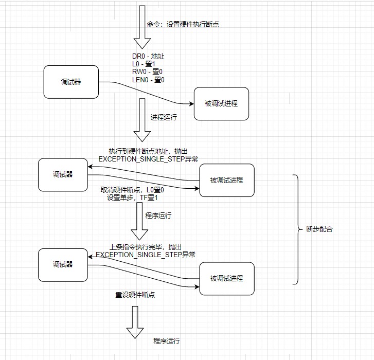
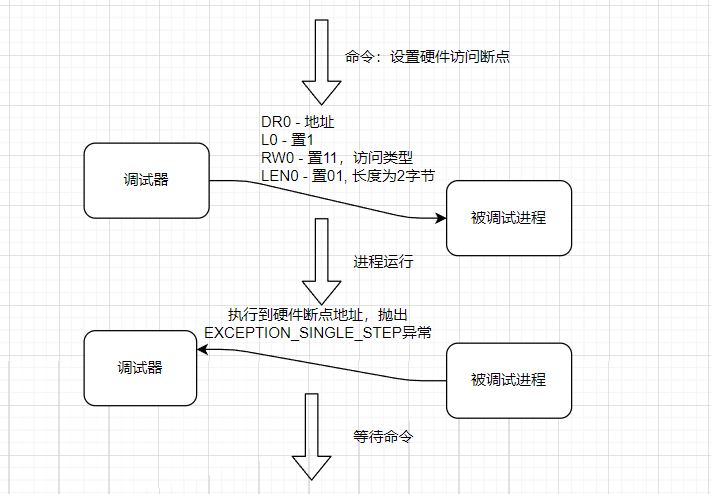

每个线程最多只能四个硬件断点，每一个可以设3种类型   ，硬件断点是由 CPU 支持的

硬件断点是为了解决某些情况下软件断点用不了的情况（例如软件中带有自修改，下断点处的代码被软件自身执行过程中把值改了）

硬件断点有3种类型

1.  执行断点,跟一般断点作用差不多
2.  写入断点   （长度有 子 ，字节 ，双字 3种）
3.  访问断点(可读可写)


### 硬件断点与调试寄存器

-   硬件断点容易被检测。
-   硬件断点通过8个32位寄存器（调试寄存器）实现；
-   硬件断点最多可设置4个，属性执行内存均可，调试寄存器命名从DR0-DR7：

-   -   DR0-DR3：表示断点的设置地址 ；
    -   DR4、DR5：与硬件断点的实现无关，可忽略；
    -   DR6：又称状态调试寄存器，表示断点命中的状态（命中为1，未命中为0）；各个位的含义如下：B0～B3，如果其中任何一个位置位，则表示是相应的Dr0~3断点引发的调试陷阱。当如果多个断点同时命中他只会把其中一个置1 ，其他的不会

-   -   -   BD置位表示是GD位置位情况下访问调试寄存器引发的陷阱。
        -   BT位:TSS任务切换时,若设置了T标志位,会引起调试异常,并使得BT位置位。
        -   BS置位表示是单步中断引发的断点。即EFLAGS的TF置位时引发的调试陷阱。
        -   DR6寄存器的值， 建议在每次异常提交之前清除。

-   -   DR7：表示设置到哪个寄存器上，L=局部（可忽略位项：GD=保护标志，GE，LE，G=全局）：

-   -   -   L0-L3=1表示对应值的DRx已启动，即L0=1表DR0启动，反之未启动，即L2=0表示DR2未启动。 
        -   LE和GE：为了兼容性，Intel建议使用精确断点时把LE和GE都设置为1。（使用精确断点标志，P6及之后的cpu不支持该标志） 
        -   16-31位：每个2位，4位一组，描述设的断点类型(R/W)和长度(LEN)，长度(LEN)对执行不起作用。

-   -   -   -   R/W0到R/W3：指定各个断点的触发条件。对应DR0到DR3中的地址以及DR6中的4个断点条件标志。

-   -   -   -   -   **00=只执行；**
                -   **01=写入数据断点；**
                -   **10=I/O端口断点（只用于pentium+，需设置CR4的DE位，DE是CR4的第3位 ）；**
                -   **11=读或写数据断点。**

-   -   -   -   LEN0到LEN3：指定在调试地址寄存器DR0到DR3中指定的地址位置的大小。
            -   如果R/Wx位为0（执行断点），则LENx位也必须为0，否则会产生不确定的行为。

-   -   -   -   -   可能取值：**00=1字节；01=2字节；10=保留；11=4字节**。

-   -   -   -   -   -   设置内存断点时，内存地址应与指定取值对齐。

-   -   

### 代码实现 获取和设置寄存器环境

```
;获取寄存器环境
GetContext proc uses esi dwTID:DWORD, pCtx:ptr CONTEXT
    LOCAL @hThread:HANDLE 
    
    invoke OpenThread, THREAD_ALL_ACCESS, FALSE, dwTID
    mov @hThread, eax
    
    mov esi, pCtx
    assume esi:ptr CONTEXT
    
    mov [esi].ContextFlags, CONTEXT_ALL
    invoke GetThreadContext, @hThread, esi   ;获取寄存器环境信息
    
    assume esi:nothing
    
    invoke CloseHandle, @hThread
    ret

GetContext endp

;设置寄存器环境
SetContext proc dwTID:DWORD, pCtx:ptr CONTEXT
    LOCAL @hThread:HANDLE 
    
    invoke OpenThread, THREAD_ALL_ACCESS, FALSE, dwTID
    mov @hThread, eax

    invoke SetThreadContext, @hThread, pCtx   ;设置寄存器环境信息

    invoke CloseHandle, @hThread
    ret

SetContext endp
```

#### 硬件执行断点



硬件断点触发 单步800000004异常，所以需要在单步异常里面区分一下。

如果有多个硬件断点，在设置DR7的时候，需要保留原有的，然后在清空自己的位，然后在设置。

注意：系统断点不是主线程，不能设置硬件断点。当有新进程创建，将所有的硬件断点寄存器重新设置一遍。

**硬件断点在抛出异常的时候，此时eip的指令没有执行。执行不过去。解决办法：断步配合。**

因为这个断点是CPU管理的，当CPU发现此时的eip和硬件断点地址相同时，就不执行了。此时的eip当前指令还没有执行，此时g和p等都过不去，如何才能让他继续执行呢？

解决办法：断步配合。再抛出硬件断点异常的时候清除当前断点，执行完这条语句后，通过单步重新设置硬件断点。

硬件执行断点

```
;设置硬件执行断点
invoke GetContext, [esi].dwThreadId, addr @ctx   ;获取寄存器环境
mov @ctx.iDr0, 01001BD2h                         ;设置下硬件执行断点的地址和寄存器 
or @ctx.iDr7, 1                                  ; L0 置 1 ,表示 在 dr0 下了断点
and @ctx.iDr7, 0fff0ffffh                        ;R/W0和LEN0都是0  (dr7 的 16 - 19位)
invoke SetContext, [esi].dwThreadId, addr @ctx   ;设置寄存器环境


;处理硬件执行断点异常
;重设硬件断点
.if g_bIsResetHardBpStep == TRUE
    mov g_bIsResetHardBpStep, FALSE
    ;设置硬件执行断点
    invoke GetContext, [esi].dwThreadId, addr @ctx     ;获取寄存器环境
    or @ctx.iDr7, 1                                    ;L0置1,说明在 dr0 设置了硬件断点 (其他的前面已经设置过了,因此这里不需要在设置)
    invoke SetContext, [esi].dwThreadId, addr @ctx     ;设置寄存器环境
    mov eax, DBG_CONTINUE
    ret
 .endif

  ;处理硬件断点的单步
  invoke GetContext, [esi].dwThreadId, addr @ctx
  .if @ctx.iDr6 & 1 ; 执行断点的异常来了dr0 上的断点
       ;取消硬件断点
       invoke GetContext, [esi].dwThreadId, addr @ctx  ;获取寄存器环境     
       and @ctx.iDr7, 0fffffffeh                       ;L0 置 0 取消 dr0 上的断点
       invoke SetContext, [esi].dwThreadId, addr @ctx  ;设置寄存器环境  
       
       ;设置单步
       invoke SetTF, [esi].dwThreadId
       ;下个单步重设硬件断点
       mov g_bIsResetHardBpStep, TRUE
       ;等待命令
       invoke InputCmd, pDE    
 .endif
```

#### 硬件访问断点



硬件访问断点不需要做断步配合

硬件访问断点原理：当cpu译码，执行的时候，才知道访问的地方是不是硬件访问断点，说以都会断到该条的下一行。

硬件访问断点

```
;设置硬件访问断点
invoke GetContext, [esi].dwThreadId, addr @ctx   ;获取寄存器环境   
mov @ctx.iDr1, 1005000h                          ;设置下硬件访问断点的地址和寄存器
or @ctx.iDr7, 100b                               ;L1 置 1 ,表示 在 dr1 下了断点
or @ctx.iDr7, 00f00000h                          ;R/W1和LEN1都是11b，访问，长度为四个字节 (dr7 的 20 - 23位)
mov @ctx.iDr6, 0                                 ;dr6清0
invoke SetContext, [esi].dwThreadId, addr @ctx   ;设置寄存器环境   


处理硬件访问异常
invoke GetContext, [esi].dwThreadId, addr @ctx
.if @ctx.iDr6 & 10b     ;访问断点的异常来了dr1 上的断点

    invoke crt_printf, offset g_szHardbpTip
    
    ;等待命令
    invoke InputCmd, pDE
.endif


```

#### 完整代码

```
.586
.model flat,stdcall
option casemap:none

   include windows.inc
   include user32.inc
   include kernel32.inc
   include msvcrt.inc
   include udis86.inc
   
   includelib user32.lib
   includelib kernel32.lib
   includelib msvcrt.lib
   includelib libudis86.lib
   
.data
    g_szExe db "winmine.exe", 0
    g_hExe  dd 0
    g_szEXCEPTION_DEBUG_EVENT         db "EXCEPTION_DEBUG_EVENT", 0dh, 0ah, 0
    g_szCREATE_THREAD_DEBUG_EVENT     db "CREATE_THREAD_DEBUG_EVENT", 0dh, 0ah, 0
    g_szCREATE_PROCESS_DEBUG_EVENT    db "CREATE_PROCESS_DEBUG_EVENT", 0dh, 0ah, 0
    g_szEXIT_THREAD_DEBUG_EVENT       db "EXIT_THREAD_DEBUG_EVENT", 0dh, 0ah, 0
    g_szEXIT_PROCESS_DEBUG_EVENT      db "EXIT_PROCESS_DEBUG_EVENT", 0dh, 0ah, 0
    g_szLOAD_DLL_DEBUG_EVENT          db "LOAD_DLL_DEBUG_EVENT", 0dh, 0ah, 0
    g_szUNLOAD_DLL_DEBUG_EVENT        db "UNLOAD_DLL_DEBUG_EVENT", 0dh, 0ah, 0
    g_szOUTPUT_DEBUG_STRING_EVENT     db "OUTPUT_DEBUG_STRING_EVENT", 0dh, 0ah, 0
    
    g_szHardbpTip                     db "硬件访问断点", 0
    
    g_szLoadDllFmt   db "%08X %s", 0dh, 0ah, 0
    g_szwLoadDllFmt   dw '%', '0', '8', 'X', ' ', '%', 's', 0dh, 0ah, 0
    g_szBpFmt  db "CC异常 %08X", 0dh, 0ah, 0
    g_szSsFmt  db "单步异常 %08X", 0dh, 0ah, 0
    g_szOutPutAsmFmt db "%08x %-20s %-20s", 0dh, 0ah, 0
    g_szInputCmd db "选择命令：", 0dh, 0ah
                db "是:设置硬件执行断点", 0dh, 0ah
                db "否:设置硬件访问断点", 0dh, 0ah
                db "取消:直接运行", 0dh, 0ah,0
                
    
    g_btOldCode db 0
    g_dwBpAddr  dd   010021a9h 
    g_byteCC   db 0CCh
    g_szOutPutAsm db 64 dup(0)
    g_ud_obj db 1000h dup(0)
    g_bIsCCStep dd FALSE
    g_bIsStepStep dd FALSE
    g_bIsResetHardBpStep dd FALSE   
   
.code  

IsCallMn  proc uses esi edi pDE:ptr DEBUG_EVENT, pdwCodeLen:DWORD
    LOCAL @dwBytesOut:DWORD
    LOCAL @dwOff:DWORD
    LOCAL @pHex:LPSTR
    LOCAL @pAsm:LPSTR
    
    mov esi, pDE
    assume esi:ptr DEBUG_EVENT
    
        ;显示下一条即将执行的指令
    invoke ReadProcessMemory, g_hExe, [esi].u.Exception.pExceptionRecord.ExceptionAddress, \
        offset g_szOutPutAsm, 20, addr @dwBytesOut
    invoke ud_init, offset g_ud_obj
    invoke ud_set_input_buffer, offset g_ud_obj, offset g_szOutPutAsm, 20
    invoke ud_set_mode, offset g_ud_obj, 32
    invoke ud_set_syntax, offset g_ud_obj, offset ud_translate_intel
    invoke ud_set_pc, offset g_ud_obj, [esi].u.Exception.pExceptionRecord.ExceptionAddress
        
    invoke ud_disassemble, offset g_ud_obj
    invoke ud_insn_off, offset g_ud_obj
    mov @dwOff, eax
    invoke ud_insn_hex, offset g_ud_obj
    mov @pHex, eax
    invoke ud_insn_asm, offset g_ud_obj
    mov @pAsm, eax
    invoke ud_insn_len, offset g_ud_obj
    mov edi, pdwCodeLen
    mov [edi], eax
    
    invoke crt_printf, offset g_szOutPutAsmFmt, @dwOff, @pHex, @pAsm
    
    mov eax, @pAsm
    .if dword ptr [eax] == 'llac'
        mov eax, TRUE
        ret        
    .endif
    
    mov eax, FALSE
    ret

IsCallMn endp

SetTF proc dwTID:DWORD
    LOCAL @hThread:HANDLE 
    LOCAL @ctx:CONTEXT
    
    invoke OpenThread, THREAD_ALL_ACCESS, FALSE, dwTID
    mov @hThread, eax
    
    mov @ctx.ContextFlags, CONTEXT_FULL
    invoke GetThreadContext, @hThread, addr @ctx
    
    or @ctx.regFlag, 100h

    invoke SetThreadContext, @hThread, addr @ctx
    invoke CloseHandle, @hThread
    
    ret

SetTF endp

DecEIP proc dwTID:DWORD
    LOCAL @hThread:HANDLE 
    LOCAL @ctx:CONTEXT
    
    invoke OpenThread, THREAD_ALL_ACCESS, FALSE, dwTID
    mov @hThread, eax
    
    mov @ctx.ContextFlags, CONTEXT_FULL
    invoke GetThreadContext, @hThread, addr @ctx
    
    dec @ctx.regEip
    
    invoke SetThreadContext, @hThread, addr @ctx
    invoke CloseHandle, @hThread
    ret

DecEIP endp

;获取寄存器环境
GetContext proc uses esi dwTID:DWORD, pCtx:ptr CONTEXT
    LOCAL @hThread:HANDLE 
    
    invoke OpenThread, THREAD_ALL_ACCESS, FALSE, dwTID
    mov @hThread, eax
    
    mov esi, pCtx
    assume esi:ptr CONTEXT
    
    mov [esi].ContextFlags, CONTEXT_ALL
    invoke GetThreadContext, @hThread, esi   ;获取寄存器环境信息
    
    assume esi:nothing
    
    invoke CloseHandle, @hThread
    ret

GetContext endp

;设置寄存器环境
SetContext proc dwTID:DWORD, pCtx:ptr CONTEXT
    LOCAL @hThread:HANDLE 
    
    invoke OpenThread, THREAD_ALL_ACCESS, FALSE, dwTID
    mov @hThread, eax

    invoke SetThreadContext, @hThread, pCtx   ;设置寄存器环境信息

    invoke CloseHandle, @hThread
    ret

SetContext endp

SetBp proc  
    LOCAL @dwBytesOut:DWORD  
    
    ;保存原来的指令， 在 01001BCF写入CC
    invoke ReadProcessMemory, g_hExe, g_dwBpAddr, offset g_btOldCode, size g_btOldCode, addr @dwBytesOut
    invoke WriteProcessMemory, g_hExe,  g_dwBpAddr, offset g_byteCC, size g_byteCC, addr @dwBytesOut
    
    ret

SetBp endp

InputCmd proc uses esi pDE:ptr DEBUG_EVENT 
    LOCAL @bIsCall:BOOL
    LOCAL @dwCodeLen:DWORD
    LOCAL @ctx:CONTEXT

    mov esi, pDE
    assume esi:ptr DEBUG_EVENT
    
    invoke IsCallMn, pDE, addr @dwCodeLen
    mov @bIsCall, eax
    invoke MessageBox, NULL, offset g_szInputCmd, NULL, MB_YESNOCANCEL
    .if eax == IDYES
    
        ;设置硬件执行断点
        invoke GetContext, [esi].dwThreadId, addr @ctx   ;获取寄存器环境
        mov @ctx.iDr0, 01001BD2h                         ;设置下硬件执行断点的地址和寄存器 
        or @ctx.iDr7, 1                                  ; L0 置 1 ,表示 在 dr0 下了断点
        and @ctx.iDr7, 0fff0ffffh                        ;R/W0和LEN0都是0  (dr7 的 16 - 19位)
        invoke SetContext, [esi].dwThreadId, addr @ctx   ;设置寄存器环境
        
    .elseif eax == IDNO
    
        ;设置硬件访问断点
        invoke GetContext, [esi].dwThreadId, addr @ctx   ;获取寄存器环境   
        mov @ctx.iDr1, 1005000h                          ;设置下硬件访问断点的地址和寄存器
        or @ctx.iDr7, 100b                               ;L1 置 1 ,表示 在 dr1 下了断点
        or @ctx.iDr7, 00f00000h                          ;R/W1和LEN1都是11b，访问，长度为四个字节 (dr7 的 20 - 23位)
        mov @ctx.iDr6, 0                                 ;dr6清0
        invoke SetContext, [esi].dwThreadId, addr @ctx   ;设置寄存器环境   
    .else
        ;直接运行
        
    .endif
    ret

InputCmd endp

OnException proc uses esi pDE:ptr DEBUG_EVENT 
    LOCAL @dwBytesOut:DWORD  
    LOCAL @ctx:CONTEXT
    mov esi, pDE
    assume esi:ptr DEBUG_EVENT
    
    .if [esi].u.Exception.pExceptionRecord.ExceptionCode == EXCEPTION_BREAKPOINT
        ;判断是否是自己的CC
        mov eax, [esi].u.Exception.pExceptionRecord.ExceptionAddress
        .if eax != g_dwBpAddr
            ;不是自己的CC异常，不处理
            mov eax, DBG_EXCEPTION_NOT_HANDLED 
            ret
        .endif
    
        ;处理自己的CC异常
        invoke crt_printf, offset g_szBpFmt, [esi].u.Exception.pExceptionRecord.ExceptionAddress
        
        ;恢复指令
        invoke WriteProcessMemory, g_hExe, g_dwBpAddr, offset g_btOldCode, size g_btOldCode, addr @dwBytesOut 
        
        ;设置单步
        invoke SetTF, [esi].dwThreadId
        invoke DecEIP, [esi].dwThreadId
        
        ;单步中需要处理CC的单步
        mov g_bIsCCStep,  TRUE
        
        ;输入命令
        invoke InputCmd, pDE
        
        mov eax, DBG_CONTINUE
        ret
    .endif
    
    ;单步来了
    .if [esi].u.Exception.pExceptionRecord.ExceptionCode == EXCEPTION_SINGLE_STEP
    
        ;处理自己的单步
        invoke crt_printf, offset g_szSsFmt, [esi].u.Exception.pExceptionRecord.ExceptionAddress

        invoke GetContext, [esi].dwThreadId, addr @ctx
        
        ;处理CC的单步
        .if g_bIsCCStep == TRUE
            mov g_bIsCCStep, FALSE
            
            ;重设断点, 重新写入CC
            ;invoke WriteProcessMemory, g_hExe,  g_dwBpAddr, offset g_byteCC, size g_byteCC, addr @dwBytesOut
            
            mov eax, DBG_CONTINUE
            ret
        .endif
        
        
        ;重设硬件断点
        .if g_bIsResetHardBpStep == TRUE
            mov g_bIsResetHardBpStep, FALSE
            
            ;设置硬件执行断点
            invoke GetContext, [esi].dwThreadId, addr @ctx     ;获取寄存器环境
            or @ctx.iDr7, 1                                    ;L0置1,说明在 dr0 设置了硬件断点 (其他的前面已经设置过了,因此这里不需要在设置)
            invoke SetContext, [esi].dwThreadId, addr @ctx     ;设置寄存器环境
            
            mov eax, DBG_CONTINUE
            ret
        .endif
        
        ;处理硬件断点的单步
        invoke GetContext, [esi].dwThreadId, addr @ctx
        .if @ctx.iDr6 & 1      ;执行断点的异常来了dr0 上的断点
            ;取消硬件断点
            invoke GetContext, [esi].dwThreadId, addr @ctx  ;获取寄存器环境     
            and @ctx.iDr7, 0fffffffeh                       ;L0 置 0 取消 dr0 上的断点
            invoke SetContext, [esi].dwThreadId, addr @ctx  ;设置寄存器环境  
            
            ;设置单步
            invoke SetTF, [esi].dwThreadId
            
            ;下个单步重设硬件断点
            mov g_bIsResetHardBpStep, TRUE

            ;等待命令
            invoke InputCmd, pDE    
                  
        .elseif @ctx.iDr6 & 10b    ;访问断点的异常来了dr1 上的断点
            invoke crt_printf, offset g_szHardbpTip
            ;硬件访问断点
            invoke InputCmd, pDE
        .endif
        
        
        mov eax, DBG_CONTINUE
        ret
    .endif
    
    assume esi:nothing
    
    mov eax, DBG_EXCEPTION_NOT_HANDLED 
    ret

OnException endp

OnCreateProcess proc 

    ;保存原来的指令， 在 01001BCF写入CC
    invoke SetBp
    
    ret

OnCreateProcess endp


main proc
    LOCAL @si:STARTUPINFO
    LOCAL @pi:PROCESS_INFORMATION
    LOCAL @de:DEBUG_EVENT 
    LOCAL @dwStatus:DWORD
    
    invoke RtlZeroMemory, addr @si, size @si
    invoke RtlZeroMemory, addr @pi, size @pi
    invoke RtlZeroMemory, addr @de, size @de
    
    mov @dwStatus, DBG_CONTINUE
    ;建立调试会话
    invoke CreateProcess, NULL, offset g_szExe, NULL, NULL, FALSE, \
        DEBUG_ONLY_THIS_PROCESS,\
        NULL, NULL,\
        addr @si,\
        addr @pi
    .if !eax
        ret
    .endif 
    mov eax, @pi.hProcess
    mov g_hExe, eax
    
    ;循环接受调试事件
    .while TRUE
        invoke WaitForDebugEvent, addr @de, INFINITE
        
        ;处理调试事件
        .if @de.dwDebugEventCode == EXCEPTION_DEBUG_EVENT
            ;invoke crt_printf, offset g_szEXCEPTION_DEBUG_EVENT
            invoke OnException, addr @de
            mov @dwStatus, eax
        .elseif @de.dwDebugEventCode == CREATE_THREAD_DEBUG_EVENT
            invoke crt_printf, offset g_szCREATE_THREAD_DEBUG_EVENT
        .elseif @de.dwDebugEventCode == CREATE_PROCESS_DEBUG_EVENT
            ;invoke crt_printf, offset g_szCREATE_PROCESS_DEBUG_EVENT
            invoke OnCreateProcess
        .elseif @de.dwDebugEventCode == EXIT_THREAD_DEBUG_EVENT
            invoke crt_printf, offset g_szEXIT_THREAD_DEBUG_EVENT
        .elseif @de.dwDebugEventCode == EXIT_PROCESS_DEBUG_EVENT
            invoke crt_printf, offset g_szEXIT_PROCESS_DEBUG_EVENT
        .elseif @de.dwDebugEventCode == LOAD_DLL_DEBUG_EVENT
            ;invoke OnLoadDll, addr @de
        .elseif @de.dwDebugEventCode == UNLOAD_DLL_DEBUG_EVENT
            invoke crt_printf, offset g_szUNLOAD_DLL_DEBUG_EVENT
        .elseif @de.dwDebugEventCode == OUTPUT_DEBUG_STRING_EVENT
            invoke crt_printf, offset g_szOUTPUT_DEBUG_STRING_EVENT
        .endif
        
        ;提交事件处理结果
        invoke ContinueDebugEvent, @de.dwProcessId, @de.dwThreadId, @dwStatus
        invoke RtlZeroMemory, addr @de, size @de
    .endw
    
    ret

main endp


start:
    invoke main 

end start
   
   
```

### 作业

 添加硬件断点。
调试器里面添加硬件断点功能
注意1
注意:设置硬件断点用的是调试寄存器、调试寄存器要注意我们拿的时候给的参数是线程句柄、线程句柄拿的时 候给的是线程id。
换句话说就是你在一个线程里面设置了断点、在別的线程中就不起作用了。所以我们设置硬件断点的时候如果 是在多线程里面一般都是遍历线程、所有的线程环境都给它设置一遍。不过此次我们模拟的都单线程的。
注意2
系统断点断下来的时候、它不再主线程里面。也就是说系统断点断下来的时候线程不是主线程（好像也是）O 此时设置context是没有任何作用的。换句话说就是在票统断点的时候设置硬件断点是没有任何作用的。
od之所以有效果、是因为od在线程创建的时候重新设置了一下。
就是系统断点有个cc、你这个时候爆设置硬件断点、设完你的调试器并不会起作用。
如何起作用？
解决办法：在入口点去设置。
比如说你在系统断点设置了硬件断点、到入口点的时候把线程遍历一下，重新给它设豈一遍就起作用了。或者 说直接设主线程的也可以。  


##### 完善调试器硬件断点功能。