## 壳原理

​    现在的壳 都在走虚拟化道路,这时候拓客就不是一个技巧性问题,而是一个时间成本问题,相当于实现了一套软件版的cpu,他的指令和真机的指令有一套对应关系,因此要脱干净需要找到对应关系,完整的还原原先所有的机器码,找到对应关系,需要吧每一条指令都要分析清楚,因此现在大多时候都是根据内存去分析他的算法

#### 1.壳的作用

-   壳对可执行文件起到保护作用。

#### 2.壳的分类

压缩壳：目的是减少PE体积。使用的是数据压缩算法，常见的如zip。

加密壳：目的是防止程序被分析，被调试，被逆向。使用的是加密算法，其中涉及反调试，反dump的技术。 

压缩壳和加密壳2者之间的差别不是很大,实现流程是一样的,只不过内容有有些不同

#### 3.压缩壳的原理

#### 4.压缩壳的实现思路

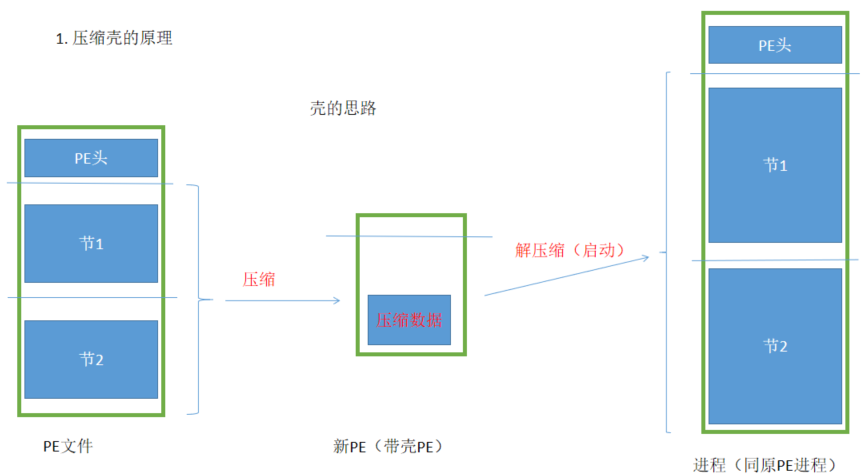

取出结区数据进行压缩,压缩数据放到新的文件里面,这个文件夹就叫做加壳后的PE,也叫新PE

这个PE 文件运行时他也会想一个正常PE一样进行映射,在映射过程中,会把压缩数据做处理,会还原原来的结数据,这一过程称为解压缩

#### 5.压缩壳的原则

-   压缩壳设计必须遵守的原则：加壳之后的 PE 文件被加载到内存中之后，其内存内容和功能，必须和加壳之前的正常 PE 的内存内容一模一样。 

#### 6.压缩壳的方法

-   在解压缩代码前开启一个空节区域，空节即没有文件大小，只有内存大小（内存大小至少大于原节总大小）的节，以便进程运行起来后，可以在内存中扩出我们所需的空间。
-   推测一个压缩壳的工作原理，可以从被压缩后的 PE 文件的节表的信息（节的名称；通过节的 VirtualSize 和节的 SizeOfRawData 的大小对比来判断是否为占坑节（SizeOfRawData 不一定是 0，也有可能是比 VirtualSize 小很多的一个值）来入手。

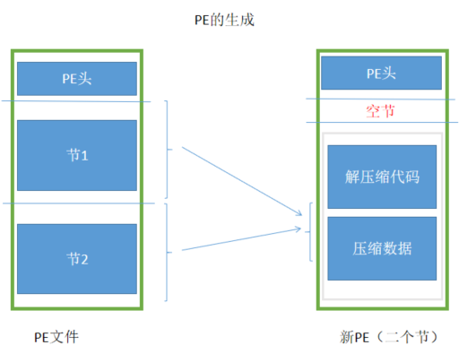

还有一种方法就是运行后申请一块堆内存,然后在 压缩数据  和 解压缩算法 拷贝到堆里面运行,然后还原结数据,还原后直接覆盖第一个节数据,样虽然麻烦一点,但是更隐蔽

### 观察upx壳

#### 1.upx壳

-   upx 壳是一个开源的、跨平台的压缩壳，它的压缩率可达到 25%以下。 

#### 2.upx命令

-   **目录下cmd运行upx命令查看命令，常用命令：**

-   -   压缩选项['-1' - '-9'] ：-1：compress faster，压缩速度更快；  -9：compress better，压缩率更高。默认是6
    -   upx脱壳：-d     decompress。

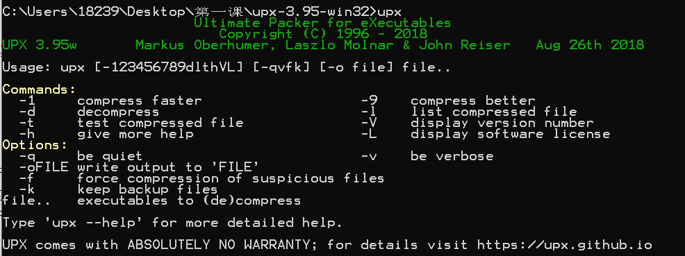

-   **语法：**upx [-一般为默认] [-一般为默认] [输出文件] 文件..
-   **示例：** upx [-123456789dlthVL] [-qvfk] [-o file] file..
-   **使用：**

-   -   upx -o dbgview_upx.exe Dbgview.exe

-   

-   -   -9 -o dbgview_upx0.exe Dbgview.exe

-   
-   **PE节对比：**
-   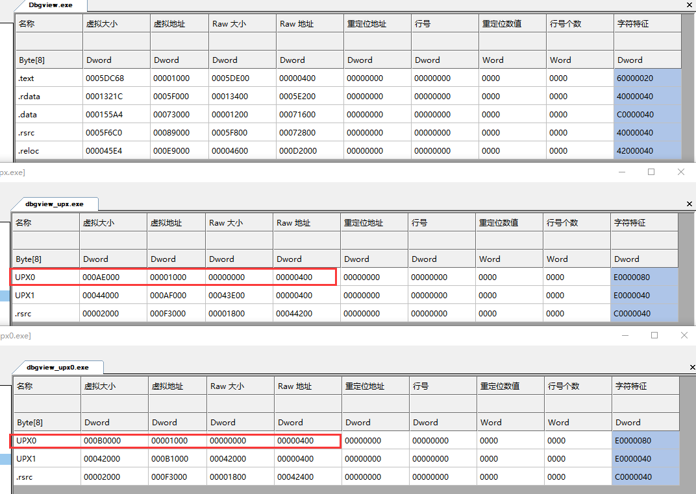

本来2个节就可以直接运行了,为啥还有一个资源节呢: 是为了储存可执行文件图标,因为资源文件如果也压缩,那么加壳后的可以行程序就没有图标了

-   **压缩后空节内存：**
-   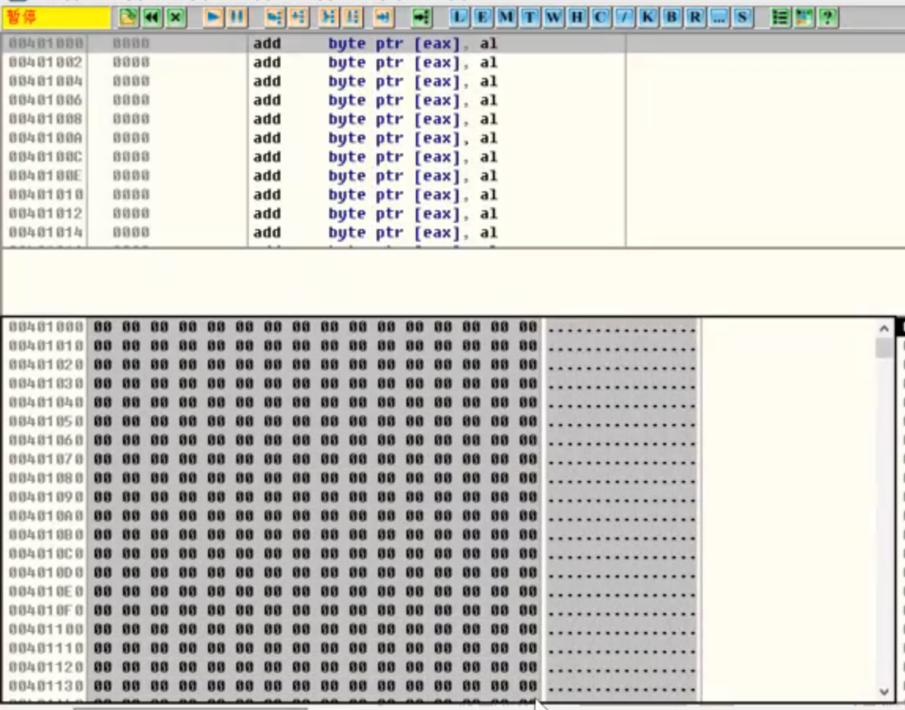

在空节下一个内存断点

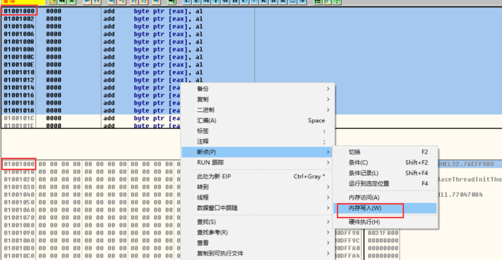

运行后解压缩的数据

### 脱壳

#### 1.脱壳目的

-   与加壳概念相反，目的是把带壳PE还原为原始PE，以便使用IDA对源码进行静态分析。

#### 2.脱壳方法

##### 静态脱壳（不推荐）

​              写一个解压缩的软件,提取出解压缩算法,但是通用性很差,而且每出一个版本可能就需要重新更新

##### Dump脱壳：

​               加壳程序运行的时候为了保证加壳后的应用程序和原来的应用程序功能一致,肯定会还原节数据,因此只需要从内存dump出来就可以了,因此成为动态脱壳.

​          dump组需要注意时机,应该在入口点(oep) dump,因此动态脱壳的重点就是 寻找 入口点(oep)

##### （1）查找OEP，OEP的识别：

-   -   -   **经验：**汇编生成的程序没有OEP特征，不同的编译器生成的程序的 OEP 处有不同的特征。汇编写的是没有特征的,常见特征：

-   -   -   -   使用 VC6 编译的程序，会在 OEP 处看到以 **GetVersion()**为开头的多个函数的连续调用。往下找，看到 push 了 3 个或者 4 个（Windows 窗口程序）的一个函数调用，那就是 main()函数。 
            -   
            -   使用 VS 2013系列后 release 版本编译的程序，会在 OEP 处看到连续的一个 call，一个 jmp（和 Debug 版本相比，第二个 call 变为 jmp 是编译器的优化），分别是 call _security_init_cookie 和 jmp_scrt_common_main_seh。第二个 jmp 跟进去找到其中的call再进去，往下走就能找到对一组函数的调用（下图3，其中**QueryPerformanceCounter**为主要API特征）。 
            -   
            -   
            -   
            -   一个有效的观察特征的方法是：下载并使用这些编译器的 IDE，写一个简单的程序，断在 main() 函数的第一句代码处，然后观察栈回溯，看看从进入主模块开始一路走来的函数调用过程。

###### 手法：

###### esp定律：

-   esp 定律对压缩壳oep的识别非常有效，因为压缩壳的 shell（用于解压缩数据的代码），为了让自己看上去没有被执行过，在运行之前和运行结束的时候一定会保存和恢复寄存器环境。保存和恢复寄存器环境最常用的是入栈和出栈,当寄存器环境从栈上弹出来,它离oep就不远了

​                                    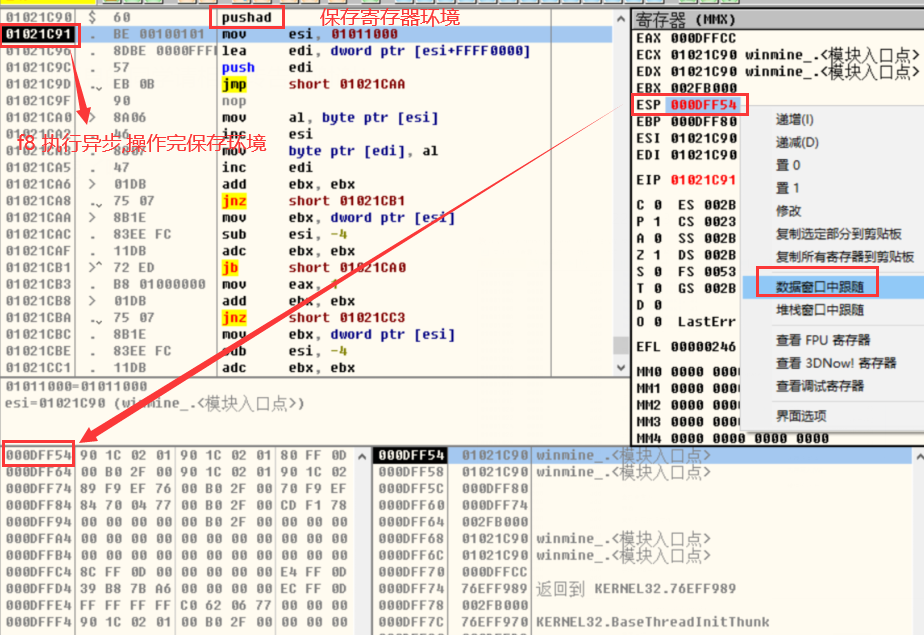

在寄存器环境下一个硬件访问断点

这样当他出栈的时候 (恢复寄存器环境就可以断下来)

这样就可以找到入口点了

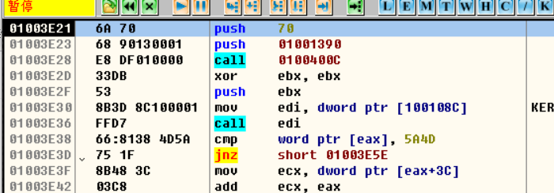

###### API断点法：

​       一般编译器在入口点调一些固定的函数

-   使用 API 查找 OEP，就是在明确了目标程序使用的哪款编译器之后（如何知道程序是哪款编译器编译出来的？根据上面说过的经验，以 VC6为例，.text 节的开始部分会有以 GetVersion()为开头的多个函数的连续调用；这其实是一个悖论：既然已经定位到 GetVersion()了，那么无需再多进行操作，直接往前找一下就是 OEP 了），在 OEP 入口的特征函数处下断点。例如，对于 VC6 编译器所生成的程序，我们可以在函数GetVersion()下断点，断下来之后 GetVersion()函数的 call 调用之前不远处，就是 OEP。在 GetVersion()函数的 call 调用之前不远处，找到了 OEP，在此下断点的时候，注意要下硬件断点，而不能是软件断点，因为软件断点写入的 0xCC 指令会被之后解压缩出来的数据所覆盖，从而造成断点失效，甚至会导致 OD 的断点管理混乱。 

因此对于一个 vs2019 的加壳程序 可以直接在程序刚启动  直接在 QueryPerformanceCounter 上下一个断点,肯定会断下来,这时候肯定离真正 OEP不远,在通过栈回溯,就能定位到oep

点击回车在上面第一个断点,在 f9 就可以断下来

在执行到函数返回,直到 找到 call  jmp

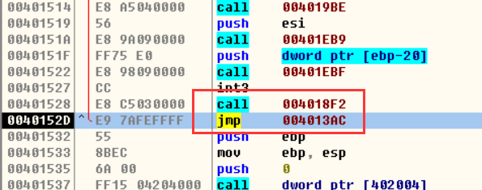

###### 通过内存断点

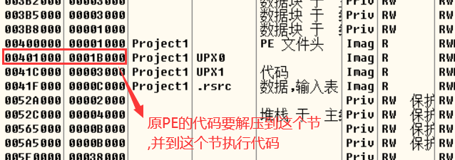

去掉执行属性

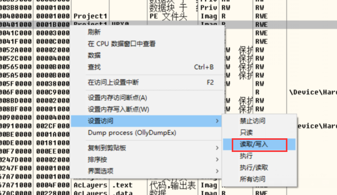

再查看记录

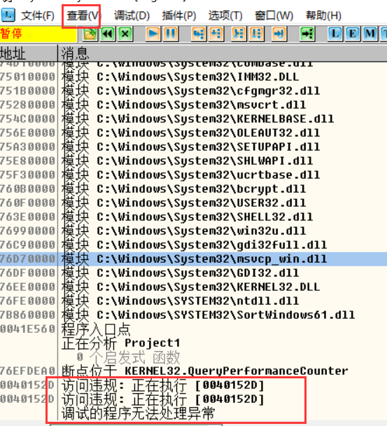

此时可以看到,到了入口点

###### 单步跟踪查找 OEP：

-   一般是在面种方法都无效的情况下，我们才会手工单步跟踪。在遇到 jmp，call 或者push+ret 的时候，只有方向是向下的时候才跟着跳转，否则就直接运行程序至下一行汇编代码处，方法：鼠标点击向上跳转的指令（例如jnz short xxxxx，机器码 75 EE）的下一行指令，按快捷键：F4。

##### （2）dump

找到OEP收首先下一个硬件执行断点断点,不能一般断点,因此代码会被重写,一般断点会被抹去

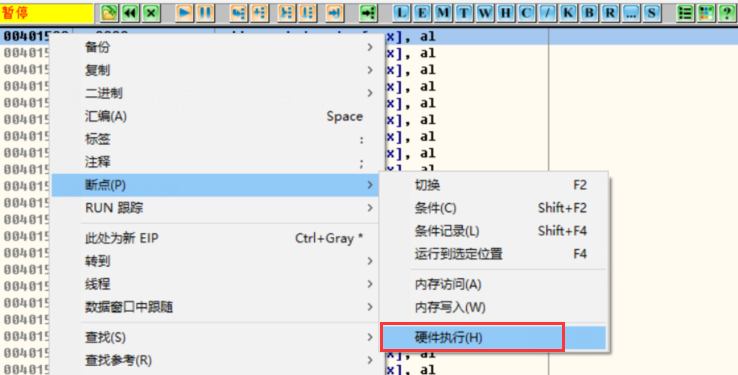

在运行程序,断下来之后就可以dump了

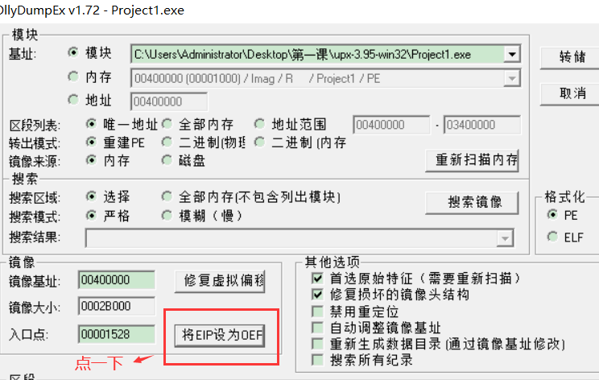

这时候 dump下来的文件一般是跑不了的

因为大多时候导入表和重定位表是有问题的,因此需要修复

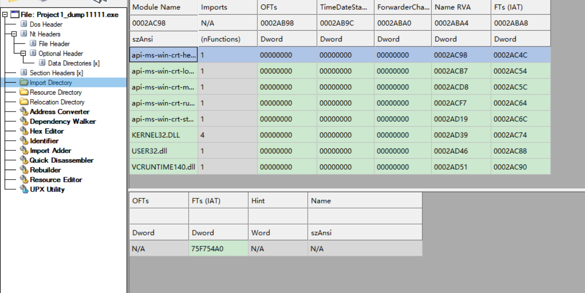

##### （3）修复PE

用x64打开加壳文件

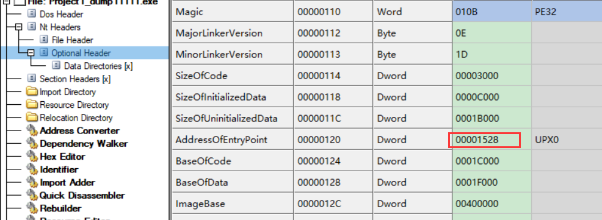

设置断点

断下来用x64自带插件dump

发现还是无法运行,通过cff  发现 pe文件数据都没什么问题,因此需要取调试找出问题

通过OD看,发现调api的地方没显示出来,说明导入表还是有问题,但是函数都有,因此可能是重定位表出问题了,那可以吧随机基址关了

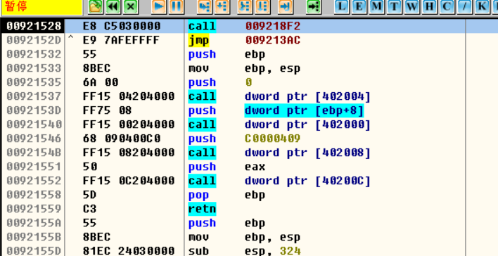

### 壳的对抗

1.   反调试
2.   混淆

-   代码膨胀
-   流程混淆
-   IAT混淆

1.  虚拟机

## 作业

脱壳 - 提交脱壳过程和修复过程文档。

dump

保存寄存器环境后就下断点

下断点

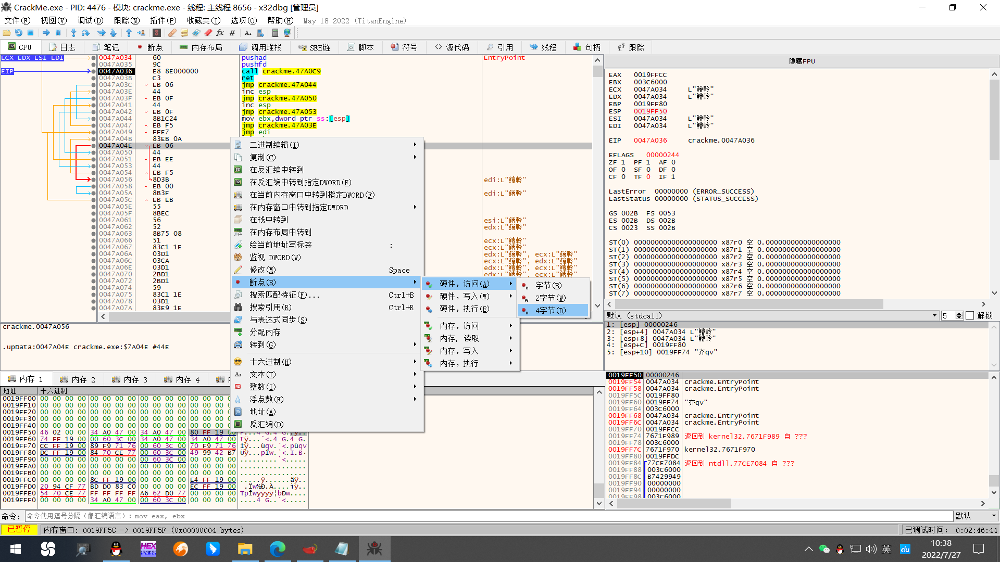

断下来后f7 到 入口点 ,dump 文件

