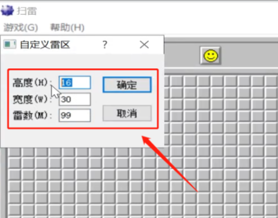
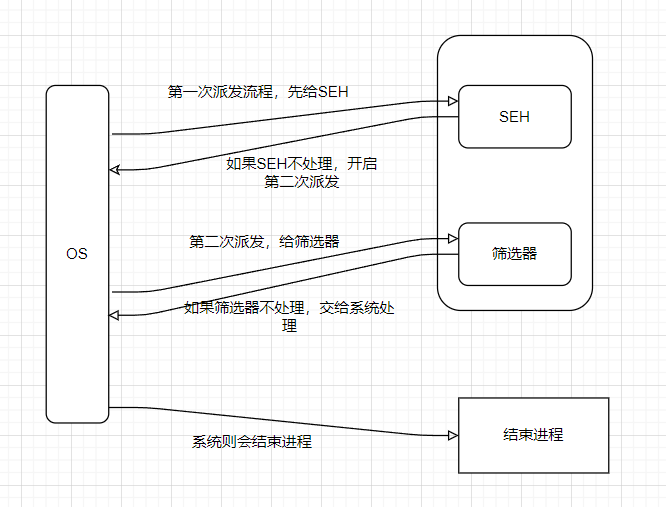
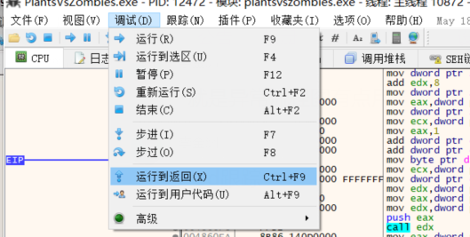
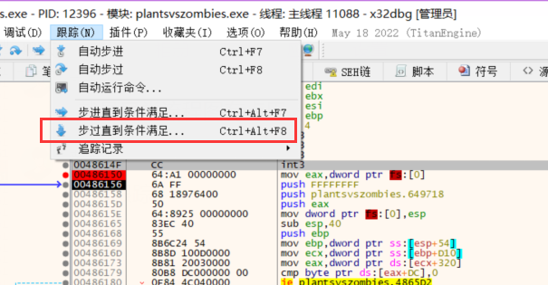
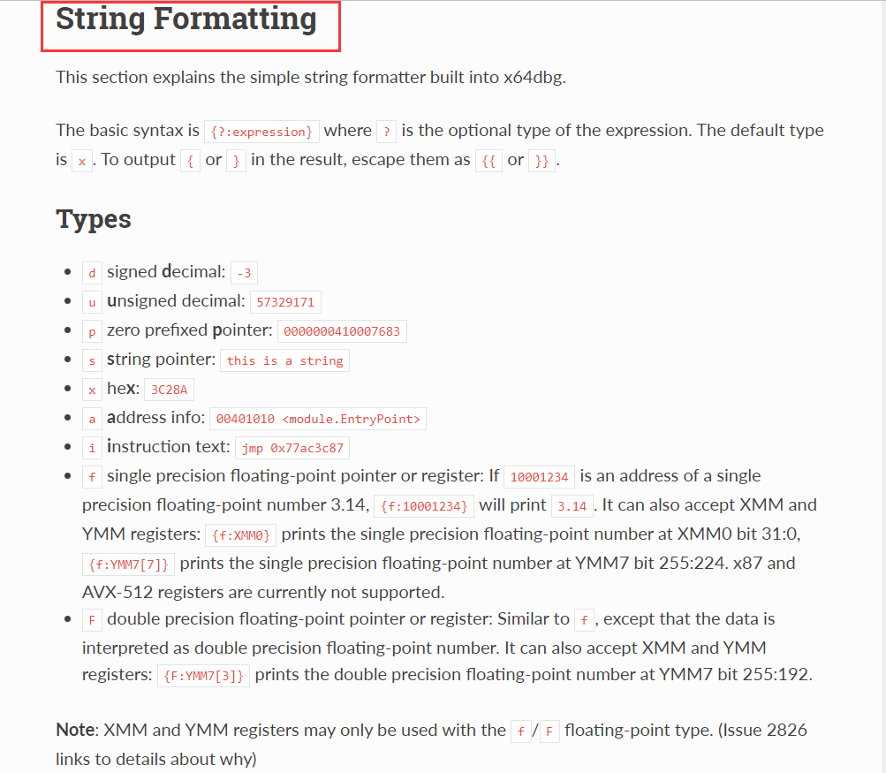

### 定位call 

 找的是话一般往外层去找,   先找数据,找到数据以后下访问断点,下了断点之后去找调用的call,到一个感觉像的,然后改改参数看看能不能达到自己想法要的效果,从而确定是不是


### 扫雷边扫雪定位关键点

扫雷变扫雪需要定位他的地图(内部存储数据的的二维数组),然后考虑程序什么时候会访问这个数组, 一般绘图的时候回访问,初始化的时候也会访问,也可以通过CE去定位,例如改变地图大小,搜数据位置,搜到之后可以下访问断点,因为地图初始化时候一定要拿地图的宽和高,然后去找二维数组,定位二维数组方法很简单,就看有几个层嵌套循环,二维数组就2个,还有一种就是直接找绘图




### 利用异常加解密代码

编译的时候把自己的代码替换掉,换成自己加密后的数据,然后再异常里进行解密


### windbg

windbug 本质是命令行工具,他的命令基本和 debug 是一致的 ,只需要注意2点

1.  符号配置:加载符号
2.  符号解析: 如dt等

他的命令分2套,一套内核用的,一套3环用的

2对四条指令     dt _peb       !peb                 dt   _teb             !teb


.reload  /f  强制所有模块重新加载


有时候  dt _peb  没有东西 ,那是因为  模块和符号没有对应     这种情况多出现于 windbg 下载过其他系统的符号,处理方法是把符号路径改一下,让他重新下载,如果要用到之前的符号,再把路径换回去,不同的版本一般会改保存符号的文件夹不同的名字,不放在一块,因为比较乱

vs修改符号


### 异常

异常主要要知道异常的派发流程

#### 非调试状态



#### 调试状态


注意:   上面的流程如果中间处理了,那就没有后面的事了,是通过返回值告诉有没有处理

​            2次调试器的的派发是通过标志区分的

除非对抗否则异常是方便我们体面的退出程序

SEH是一个链表,他会沿着链表往上回溯,要注意的是安装和卸载


## APIHOOK重入功能

apihook   拦截api的调用流程,拦截到自己这里

注意点：

1.  偏移的计算
2.  寄存器环境变量要保存
3.  APIHOOK重入功能


字节的函数没有预留的三行，想要hook自己写的函数——见招拆招(针对不同的函数去写跳和恢复),如果想要通用,就得上反汇编引擎


### x32dbg跟踪功能

以找植物大战僵选只为界面为例

首先通过 增减值物数量 在 CE种找到植物数量地址


再到x32dbg 内存中转到该地址


这样再去选植物就可以断下来了


然后网上找call ,因为肯定会有植物种类这个参数




查看分支:


#### 跟踪




[https://x64dbg.com](https://x64dbg.com/)





在分别选择高亮 和 不高亮的 分别追踪,对比2个文本 内容,查看分支条件


再跳转到地址查看 判断条件以及逻辑


### 花指令

欺骗反调试器 

正常代码

```
push ebp
	jmp LABEL0
	
	LABEL0:
	mov ebp, esp
	
	jmp LABEL1

	LABEL1:
	sub esp, 5560	
```

花指令代码

```
push ebp
	jmp LABEL0
	db 0e9h
	LABEL0:
	mov ebp, esp
	
	jmp LABEL1
	db 0e9h
	db 00
	db 01
	db 00
    db 00
	LABEL1:
	sub esp, 5560	
```

在调试器中看


因为反汇编引擎是通过内存读数据 ,先拿操作码再拿操作数    ,所以读取到    db 0e9h  会转成 jmp  ,后面四个字节当做地址 ,但并不影响软件运行时, cpu执行是  碰到跳转 就直接跳,跳转中间的代码就直接忽略了,凡事调试器需要反汇编出来

花指令

```
push ebp
jmp LABEL0
db 0e9h
LABEL0:
mov ebp, esp
	
jmp LABEL1
db 0e9h
db 00
db 01
db 00
LABEL1:
sub esp, 5560
```


上面代码 到 db 0e9h   后反汇编成 jmp ,   jmp 后面需要四个字节的地址 , 从而导致后面反汇编代码错误(有一个字节被取走了,导致后面解析指令出错)


去除花指令方法 :   碰到跳转直接跳 , 忽略中间指令