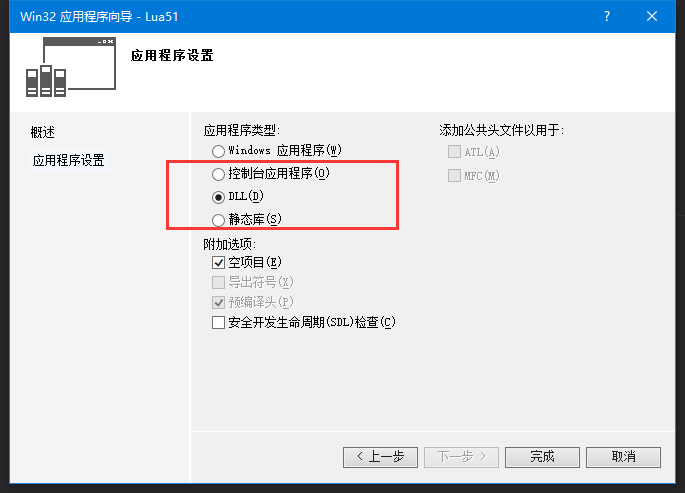
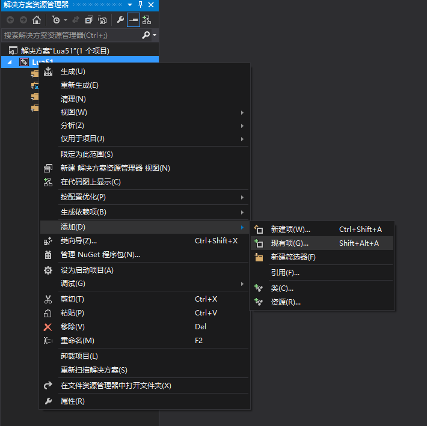
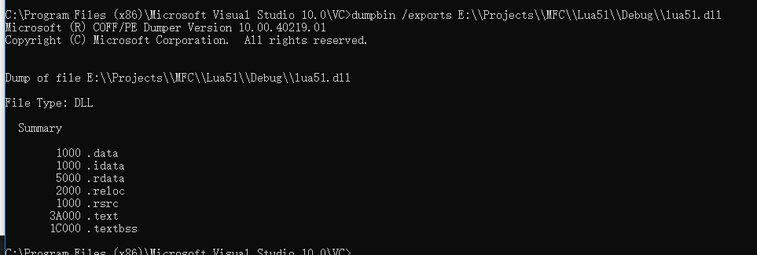
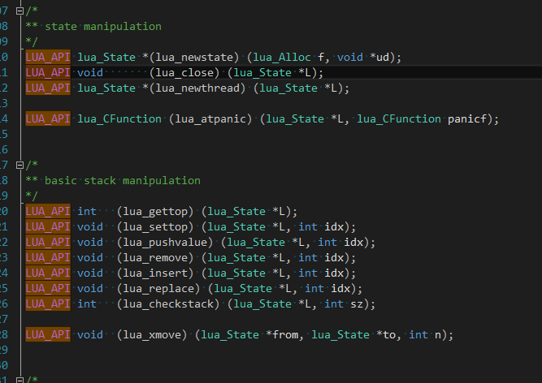
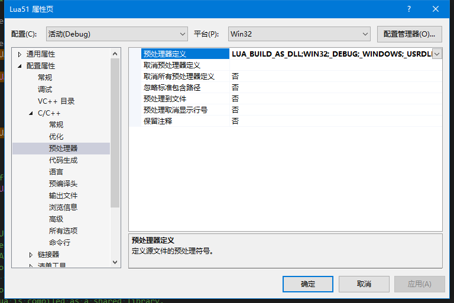
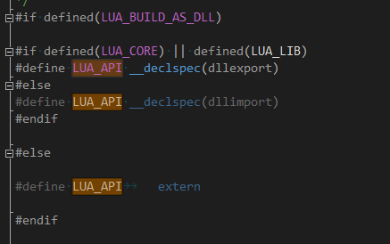
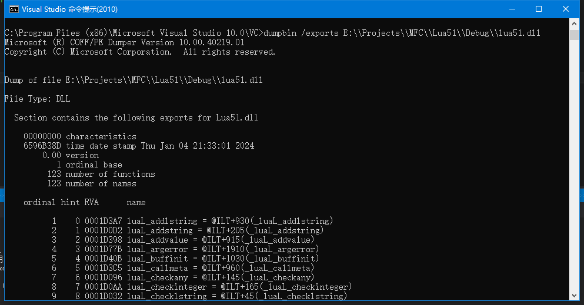
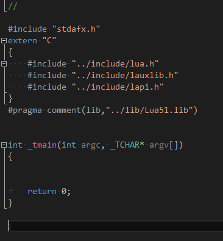
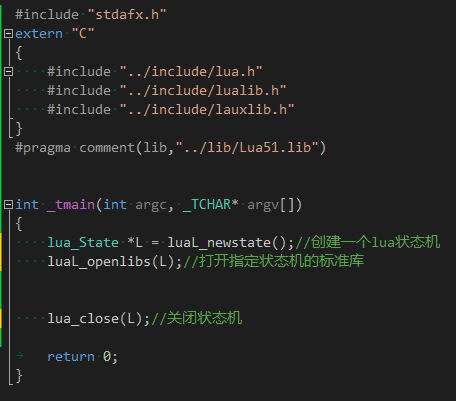
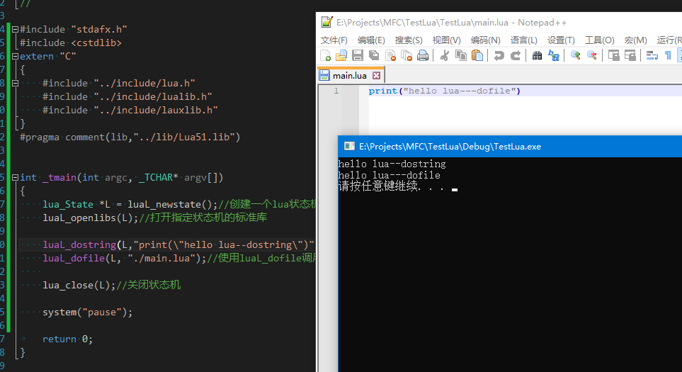

### 一、lua库下载与编译

进入lua官网 https://lua.org/versions.html

找到lua5.1

选择lua5.1是因为大部分游戏使用的都是lua5.1的库，也可以选择高版本，影响不大

下载完了后使用vs建立一个静态库或者动态库的工程

这里以动态库为例子，静态库也是一样的操作方式

工程建立好了以后，将下载好的lua5.1解压，把压缩包里面src文件夹里面的所有文件都复制到我们建立的工程目录下面去，然后在我们的工程中把复制进去的文件都导入到工程里面

因为luac.c和lua.c这两个文件定义了main函数，所以现在编译是会出错的，我们要么删除或者不导入这两个文件，要么给这两个文件中的main函数改个名字即可

现在编译就可以通过了，虽然现在已经生成了DLL，但是没有任何的导出函数，通过dumpbin /exports可以验证这一点

这是因为lua函数定义的时候在前面都加入了LUA_API

而LUA_API的定义是下面这样的

也就是说，如果没有定义LUA_BUILD_AS_DLL这个宏的话，LUA_API 就被解释成了 extern 如果定义了就会被解释成 __declspec(dllexport)或者__declspec(dllimport)，所以我们需要在项目-属性-C/C++-预处理器中增加这个定义

我们增加了这个定义后

现在再重新编译就有了导出函数了

至此，我们就已经把LUA编译成了DLLG供C/C++来使用了

### 二、在C/C++中使用Lua

使用VS建立一个控制台项目，用来进行前期lua调用C/C++和C/C++调用Lua的测试

首先要把lua.h lualib.h lauxlib.h lua51.lib lua51.dll放到我们项目里面来，然后在我们的项目中包含这3个头文件和lib文件，注意，由于我们的lua库是使用C语言的方式编译并导出的，而我们项目是C++的，所以需要把includelua头文件的代码加上extern "C"

引用静态库可以使用#pragma comment(lib,"../lib/Lua51.lib")，也可以在项目属性里面设置

调用lua之前我们先要获取一个状态机，获取完了状态机在打开lua的标准库，使用完了以后还需要关闭状态机

打开状态机 luaL_newstate

打开标准库 luaL_openlibs

关闭状态机 lua_close

现在再来测试一下lua是否可用，我们可以使用lua_dostring来测试某条或者某几条lua指令，也可以使用lua_dofile来调用一个lua文件

