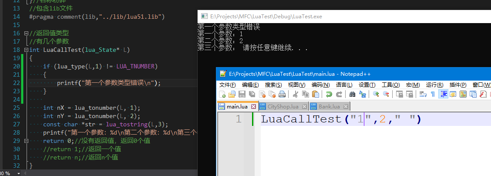
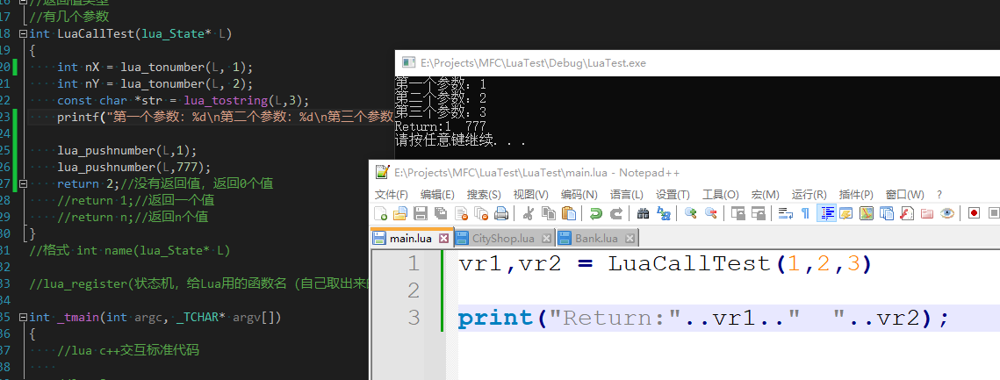

**传递数组参数**

传递数组也是通过堆栈操作，传递数组的话首先要获取数组的长度

数组的出长度通过luaL_getn(L,1)来获取，数组的长度会存放在栈底

获取到数组的长度用循环来遍历即可，取数组的值通过lua_pushnumber(L,i)(注意，Lua数组的下标是1开始的)，压入栈表示是我们要取数组第i个位置的值，压入后再使用lua_gettable(L,1) 这个函数会弹出数组索引 然后把数组第i元素压入栈，再通过lua_to....即可取出来数组的元素

**传递表参数**

传递表通过lua_next函数来获取，该函数从栈顶弹出一个key,从栈指定位置取出下一对key-value,先将key入栈，再将value入栈，失败返回0

如果只要取某个key对应的value的话，使用lua_getfield函数即可

**参数检查**

通过luaL_checktype函数来检查，但是这个函数如果检查类型不对的话就不会继续执行，如lua_checktype(L,1,LUA_TNUMBER)

类型正确时

类型错误时

这种方法最大的缺点就是一旦类型错误就不会继续往下执行，还可以通过lua_type(L,n) != LUA_TNUMBER来做检查

**返回值获取**

我们之前有提到，Lua调用C/C++返回值个数是通过 return n来确定的，如果我们需要返回一个值，就只要return 1就行了，返回值也是放在栈上面的，通过lua_push....来压入栈即可

