## 为什么要编译自己的CE

​	在游戏逆向的过程中，很多游戏有保护，我们运行原版CE的时候会被检测到

​	比如我们开着CE运行英雄联盟的时候就会提示：

​		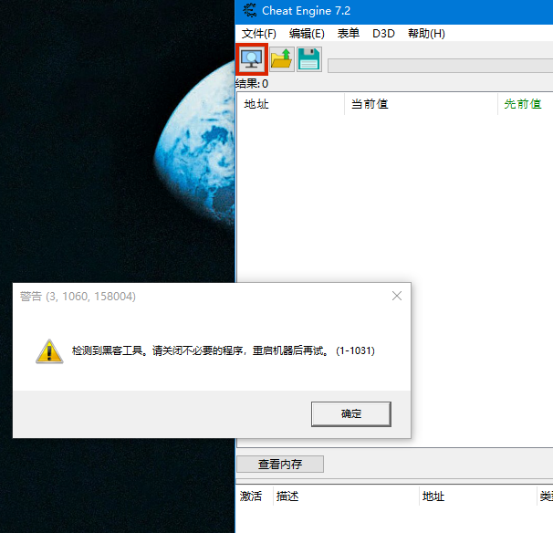


但是我们使用自己编译的的CE的时候就没有问题

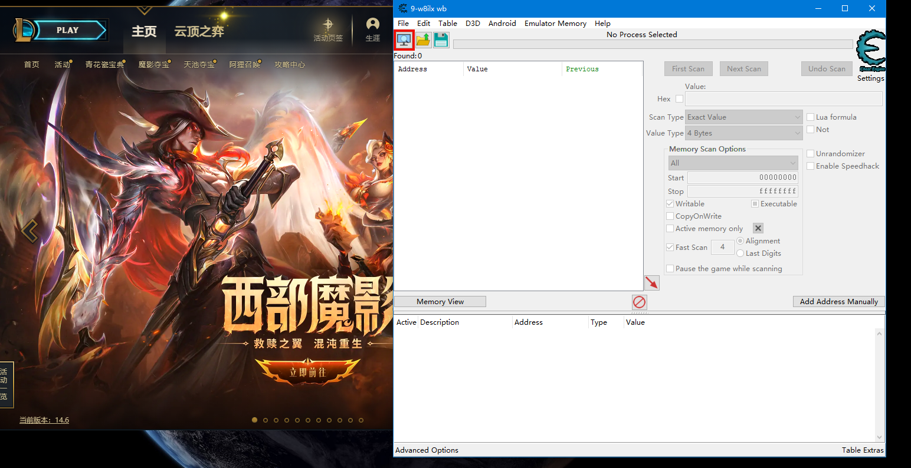

## 必要的工具

### cheat-engine source code

​	https://github.com/cheat-engine/cheat-engine

### lazarus-2.2.2-fpc-3.2.2-cross-i386-win32-win64 and lazarus-2.2.2-fpc-3.2.2-win64

​	https://www.lazarus-ide.org/

​	https://sourceforge.net/projects/lazarus/files/Lazarus%20Windows%2064%20bits/Lazarus%202.2.2/

### vmp3.5

### notepad++

## 如何编译CE

1、首先下载并解压CE源码

2、安装

lazarus-2.2.2-fpc-3.2.2-cross-i386-win32-win64

然后安装

lazarus-2.2.2-fpc-3.2.2-win64


安装过程省略........

安装好了以后打开CE源码目录里面的

\cheat-engine-master\Cheat Engine 文件夹

里面有个

cheatengine.lpi 文件 双击打开即可

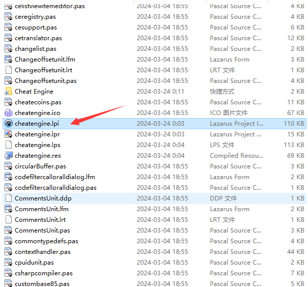


打开后界面如下所示：

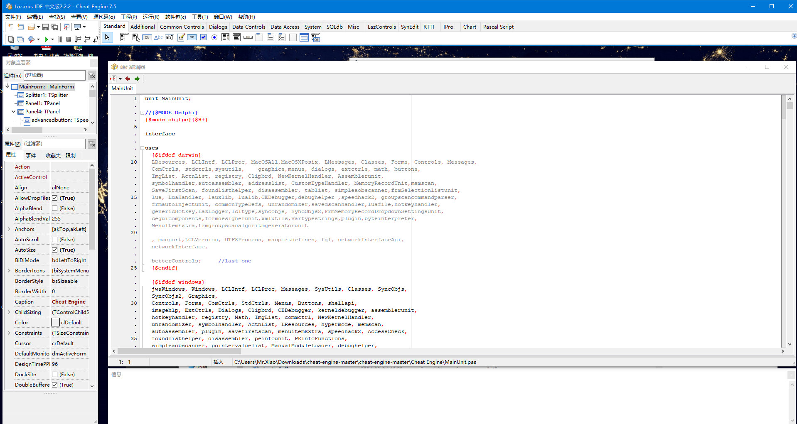

如果要查看窗口的话，按F12即可


现在就已经可以看到CE的主UI了

现在来修改CE的窗口标题和进程名

​	点击工程-工程选项


会打开下面的窗口

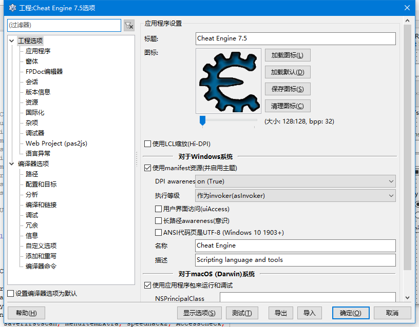

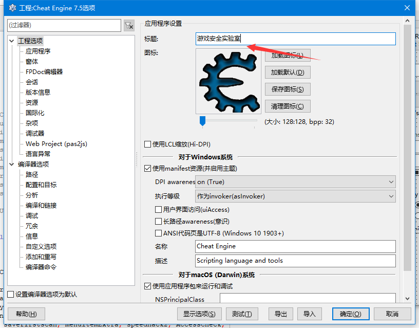

这里可以修改标题（然并卵）

点击左边的版本信息

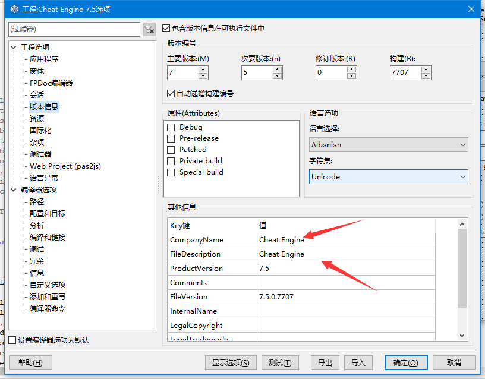

这里面的信息都可以改成我们自己的

然后再点击左侧的路径

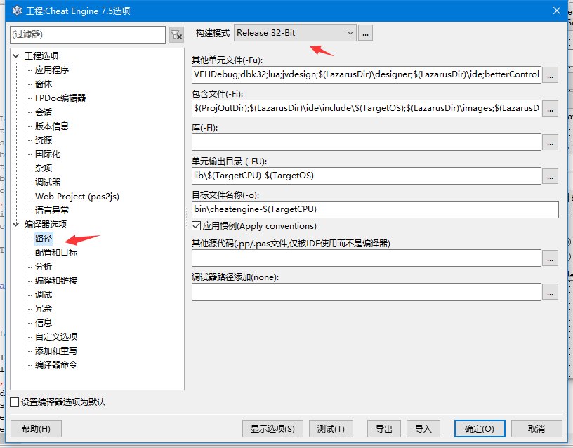

把目标文件名改成我们自己的，注意32位和64位都要改

改好以后点确定关闭窗口，然后点运行--编译多种模式

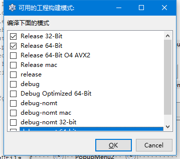

选择32位和64位就行了，然后点OK就开始漫长的构建过程。。。。

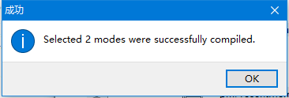

提示编译成功即可。编译好的文件在cheat-engine-master\Cheat Engine\bin目录，文件名就是我们自己定义的

然而我们发现，进程名确实改了，进程信息也改了，but,进程标题没有变

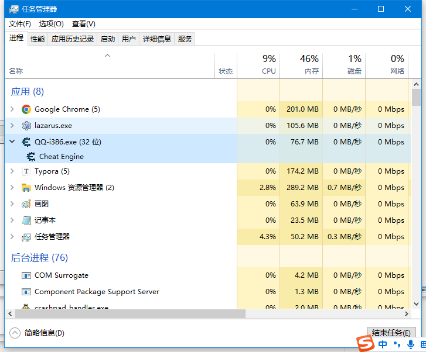

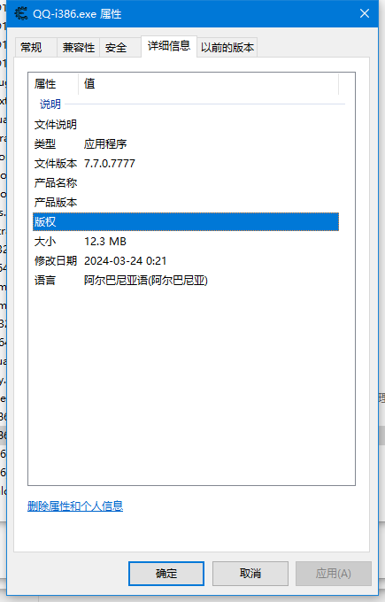

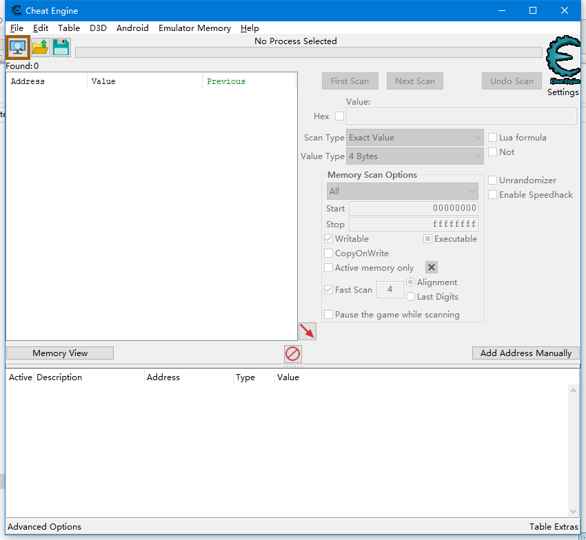

窗口标题没有改变是因为在CE的源码中是写死的，所以我们要去源码中改

我们点击菜单中的工程--单元

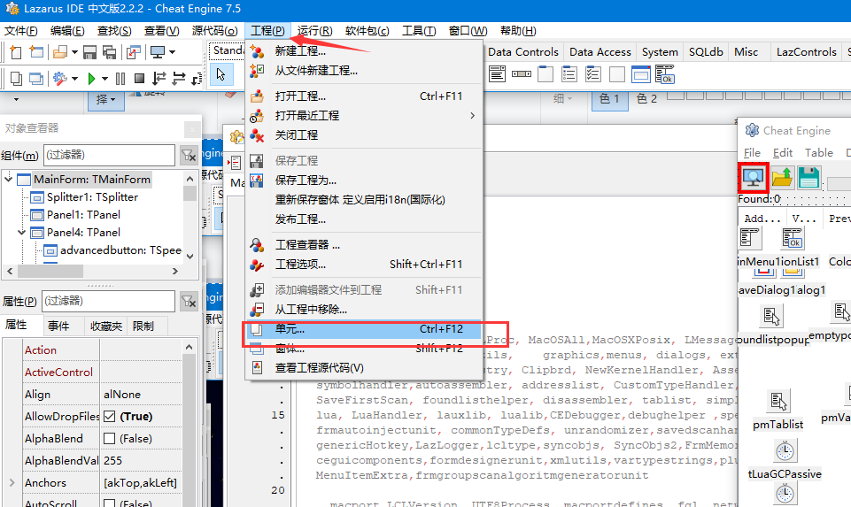

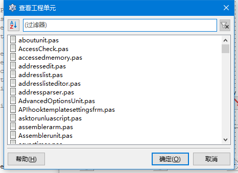

在这个窗口中输入main

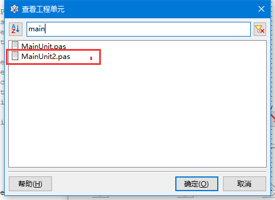

双击这个文件

在这个文件中按crtl+f搜索 cename


或者直接到代码最下面，找到如下代码：

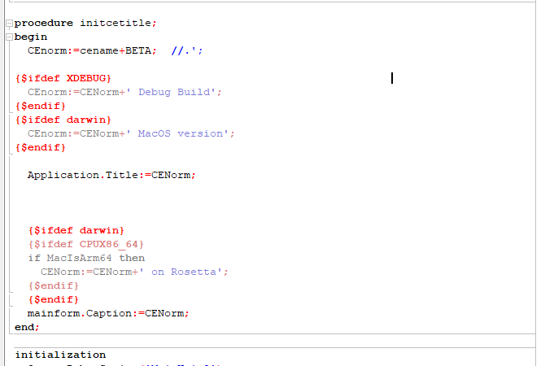

把cename改成我们需要的字符串，然后编译

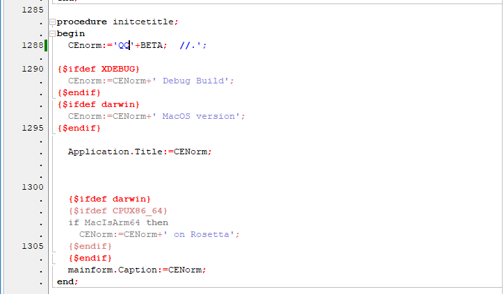

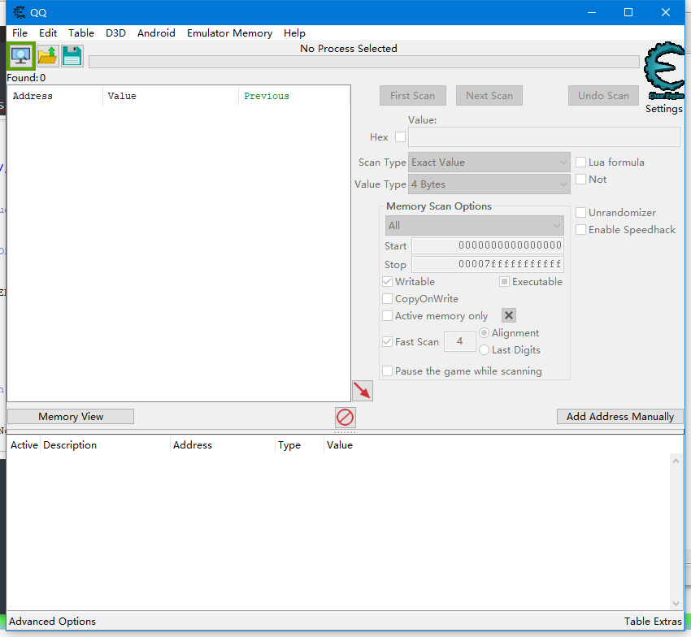

可以看到，窗口标题已经改掉了

我们即便把标题改成自己的，也有可能被游戏加到黑名单，如果我们用N个字母随机化标题的话，就没那么容易被检测到了，所以我们加入随机窗口标题的代码

随机标题代码

```pascal
function CreateNewceWindowsText :string;
const
  Chars = 'ABCDEFGHIJKLMNOPQRSTUVWXYZabcdefghijklmnopqrstuvwxyz0123456789!@#$%^&*()_+-=[]{}; \|:",.<>/?`~';
var
  StrText: string;
  i, index: integer;
begin
  Randomize;
  StrText := '';
  for i := 1 to 10 do begin
    index := Random(Length(Chars)) + 1;
    StrText := StrText + Chars[index];
  end;
  result := StrText;
end;
```

最终效果：


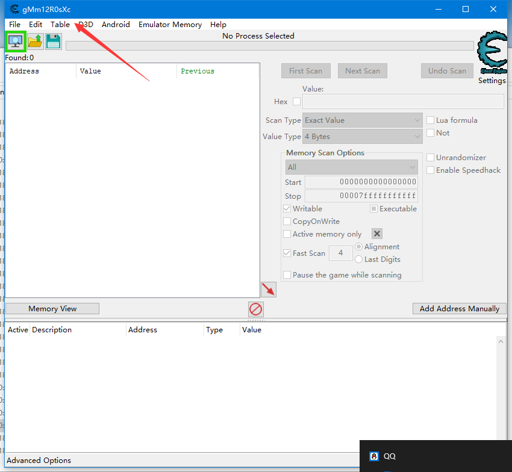